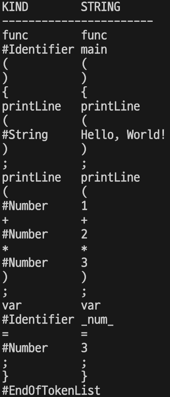

# 2. 어휘 분석

어휘 분석은 프로그래밍 언어로 작성한 소스 코드의 문자열을 분석하는 과정이다. 소스 코드 문자열은 키워드, 식별자, 연산자, 구분자, 숫자 리터럴, 문자열 리터럴로 구성된다.

- 키워드: for, if, func 등과 같이 프로그래밍 언어에서 특별하게 취급하는 어휘

- 식별자: 변수나 함수의 이름과 같이 사용자가 정의하는 어휘

- 연산자: 더하기나 빼기와 같이 계산을 하기 위한 기호

- 구분자: 괄호나 세미콜론과 같이 어휘들을 구분 짓기 위한 기호

- 숫자 리터럴: 123, 1.2 등과 같이 코드에 작성된 정수와 실수

- 문자열 리터럴: "Hello", "World" 등과 같이 따옴표로 둘러싸인 문자들의 나열

어휘 분석은 소스 코드 문자열의 어휘를 분석하는 것이다.

## 2.1 어휘와 토큰

어휘 분석, 즉 소스 코드 문자열을 분석하기 위해서 가장 먼저 해야 할 일은 소스 코드에서 사용되는 어휘들을 정의하는 것이다. 다음과 같이 어휘의 종류를 열거형으로 나열한다.

```cpp
enum class Kind {
  Unknown, EndOfTokenList,
  NullLiteral,
  TrueLiteral, FalseLiteral,
  NumberLiteral, StringLiteral,
  Identifier,

  Function, Return,
  Variable,
  For, Break, Continue,
  If, Elif, Else,
  Print, PrintLine,

  Comment,

  LogicalAnd, LogicalOr,
  Assignment,
  Add, Subtract,
  Multiply, Divide, Modulo,
  Equal, NotEqual,
  LessThan, GreaterThan,
  LessOrEqual, GreaterOrEqual,

  Comma, Colon, Semicolon,
  LeftParen, RightParen,
  LeftBrace, RightBrace,
  LeftBracket, RightBracket,
};
```

> C에서의 enum 과 다른 점
> 스코프 존재: Kind::Unknown처럼 접근해야 함. 이름 충돌 방지.
> 타입 안전: 암묵적으로 int로 변환되지 않음. 명시적으로 형변환해야 함.
> 기본 타입 설정 가능: 원하는 타입으로 지정 가능 (enum class Color : uint8_t { RED, GREEN }; )

이 열거형의 멤버들은 앞으로 'for'나 'if' 등과 같은 문자열을 대신할 상수들이다. 소스 코드 문자열에 포함된 어휘 문자열들을 위 열거형의 멤버들과 연관시켜야 하므로 다음과 같이 연관 데이터도 작성한다.

```cpp
static map<string, Kind> stringToKind = {
  {"#Unknown",    Kind::Unknown},
  {"#EndOfTokenList", Kind::EndOfTokenList},

  {"null",        Kind::NullLiteral},
  {"true",        Kind::TrueLiteral},
  {"false",       Kind::FalseLiteral},
  {"#Number",     Kind::NumberLiteral},
  {"#String",     Kind::StringLiteral},
  {"#Identifier", Kind::Identifier},

  {"func",        Kind::Function},
  {"return",      Kind::Return},
  {"var",         Kind::Variable},
  {"for",         Kind::For},
  {"break",       Kind::Break},
  {"continue",    Kind::Continue},
  {"if",          Kind::If},
  {"elif",        Kind::Elif},
  {"else",        Kind::Else},
  {"print",       Kind::Print},
  {"printLine",   Kind::PrintLine},

  {"//",          Kind::Comment},

  {"and",         Kind::LogicalAnd},
  {"or",          Kind::LogicalOr},

  {"=",           Kind::Assignment},

  {"+",           Kind::Add},
  {"-",           Kind::Subtract},
  {"*",           Kind::Multiply},
  {"/",           Kind::Divide},
  {"%",           Kind::Modulo},

  {"==",          Kind::Equal},
  {"!=",          Kind::NotEqual},
  {"<",           Kind::LessThan},
  {">",           Kind::GreaterThan},
  {"<=",          Kind::LessOrEqual},
  {">=",          Kind::GreaterOrEqual},

  {",",           Kind::Comma}, 
  {":",           Kind::Colon},
  {";",           Kind::Semicolon},
  {"(",           Kind::LeftParen},
  {")",           Kind::RightParen},
  {"{",           Kind::LeftBrace},
  {"}",           Kind::RightBrace},
  {"[",           Kind::LeftBracket},
  {"]",           Kind::RightBracket},
};
```

어휘의 종류와 문자열을 묶어 토큰이라고 한다. 예를 들어 키워드 for 토큰의 문자열은 'for' 이고 종류는 Kind::For 이다. 쌍이 되는 어휘의 종류와 문자열을 묶어 다룰 수 있도록 다음과 같이 토큰 구조체를 작성한다. 어휘 분석의 결과는 토큰 구조체의 리스트다.

```cpp
struct Token {
  Kind kind = Kind::Unknown;
  string str;
}
```

## 2.2 어휘 분석기

어휘 분석은 소스 코드 문자열에 포함된 어휘들을 분석하는 것이고, 토큰은 분석된 어휘의 문자열과 종류의 쌍을 의미한다. 어휘 분석기는 소스 코드의 어휘를 분석하는 프로그램으로 소스 코드 문자열을 입력받아 토큰 리스트를 출력한다. 

어휘 분석을 하는 함수 scan()을 Scanner.h 에 선언한다.

```cpp
auto scan(string)->vector<Token>;
```

main() 함수에서는 다음과 같이 소스 코드 문자열을 인자로 scan() 함수를 호출한다.

```cpp
vector<Token> tokenList = scan(sourceCode);
```

### 2.2.1 소스 코드 문자열

scan() 함수에서는 소스 코드 문자열을 처음부터 끝까지 문자 단위로 순회하며 토큰 리스트에 토큰을 추가해 나간다. 그리고 순회가 끝나면 토큰 리스트에 EndOfTokenList 토큰을 추가한 후 토큰 리스트를 반환한다.

```cpp
static string::iterator current;

auto scan(string sourceCode) -> vector<Token> {
  vector<Token> result;
  sourceCode += '\0';
  current = sourceCode.begin();
  while (*current != '\0') {

  }
  result.push_back({ Kind::EndOfTokenList });
  return result;
}
```

위 코드를 보면 매개변수로 받은 소스 코드 문자열의 끝에 널 문자를 추가하고, 현재 문자가 널이 아닐때까지 while문을 반복한다. 그리고 while문이 종료된 후에는 토큰 리스트에 EndOfTokenList 토큰을 추가한다. current는 현재 문자를 가리키는 전역변수이다.

### 2.2.2 어휘의 시작 문자

while문에서는 현재 문자가 무엇이냐에 따라 행동을 달리한다.

```cpp
switch (getCharType(*current)) {
default:
  cout << *current << " is not useable" << endl;
  exit(1);
}
```

```cpp
enum class CharType {
  Unknown,                // 사용할 수 없는 문자
  WhiteSpace,             // 공백, 탭, 개행
  NumberLiteral,          // 숫자 리터럴
  StringLiteral,          // 문자열 리터럴
  IdentifierAndKeyword,   // 식별자, 키워드
  OperatorAndPunctuator,  // 연산자, 구분자
};

auto getCharType(char c) -> CharType {
  return CharType::Unknown;
}
```

getCharType() 함수는 현재 문자의 종류를 반환한다. 문자의 종류는 열거형 CharType에 정의된다.

소스 코드 문자열에 포함될 수 있는 문자열 중 공백, 탭, 캐리지 리턴, 개행은 토큰을 생성할 필요가 없다. 따라서 다음과 같이 getCharType() 함수에 조건을 추가해 WhiteSpace를 반환하도록 한다.

```cpp
if (' ' == c || '\t' == c || '\r' == c || '\n' == c) {
    return CharType::WhiteSpace;
  }
```

scan() 함수의 switch 문에서 getCharType()의 반환값이 WhiteSpace인 경우 현재 문자를 무시하도록 한다.

```cpp
case CharType::WhiteSpace:
  ++current;
  break;
```

### 2.2.3 숫자 리터럴의 시작 문자

숫자 리터럴은 숫자로 시작하므로 현재 문자가 숫자라면 숫자 리터럴의 시작 문자다.

현재 문자가 숫자라면 NumberLiteral을 반환하도록 getCharType() 함수에 조건을 추가한다.

이후 getCharType() 함수의 반환값이 NumberLiteral 이라면 숫자 리터럴 문자열을 분석해서 토큰 리스트에 추가하도록 switch문에 조건을 추가한다.

```cpp
if ('0' <= c && c <= '9') {
  return CharType::NumberLiteral;
}

case CharType::NumberLiteral:
  result.push_back(scanNumberLiteral());
  break;
```

숫자 리터럴 토큰을 분석하는 scanNumberLiteral() 함수는 다음과 같다. scanNumberLiteral() 함수는 isCharType() 함수를 필요로 한다.

```cpp
static const string oper_punc = "=+-*/%!<>,:;(){}[]";
auto isCharType(char c, CharType type) -> bool {
  switch (type) {
  case CharType::NumberLiteral: {
    return '0' <= c && c <= '9';
  }
  case CharType::StringLiteral: {
    return 32 <= c && c <= 126 && c != '"'; // 아스키 코드에서의 출력 가능한 문자
  }
  case CharType::IdentifierAndKeyword: {
    return ('0' <= c && c <= '9') || ('a' <= c && c <= 'z') && ('A' <= c && c <= 'Z');
  }
  case CharType::OperatorAndPunctuator: {
    return oper_punc.find(c) != string::npos;
  }
  default: {
    return false;
  }
  }
}
auto scanNumberLiteral() -> Token {
  string str;
  while (isCharType(*current, CharType::NumberLiteral)) {
    str += *current++;
  }
  if (*current == '.') {
    str += *current++;
    while (isCharType(*current, CharType::NumberLiteral)) {
      str += *current++;
    }
  }
  return Token{ Kind::NumberLiteral, str };
}
```

위 구현은 0을 숫자 리터럴의 시작 문자로 허용한다. 그런데 십진수는 0으로 시작해도 의미가 없다. 0으로 시작하는 숫자 리터럴은 대부분 2진수, 8진수, 16진수를 위한 것이다. 구현 자체는 어렵지 않으니 나중에 시도해보자.

### 2.2.4 문자열 리터럴의 시작 문자

문자열 리터럴은 따옴표로 시작하므로 현재 문자가 따옴표라면 문자열 리터럴의 시작 문자다.

다음과 같이 StringLiteral을 반환하도록 getCharType() 함수에 조건을 추가하자.

```cpp
if (c == '"') {
  return CharType::StringLiteral;
}
```

scan() 함수에서 getCharType() 함수가 반환한 문자열의 종류가 StringLiteral 이라면 문자열 리터럴 문자열을 분석해서 토큰 리스트에 추가하도록 switch문에 조건을 추가한다.

```cpp
case CharType::StringLiteral: {
  result.push_back(scanStringLiteral());
  break;
}
```

다음은 scanStringLiteral() 함수이다.
```cpp
auto scanStringLiteral() -> Token {
  string str;
  ++current;
  while (isCharType(*current, CharType::StringLiteral)) {
    str += *current++;
  }
  if (*current != '"') {
    cout << "There is no string terminator" << endl;
    exit(1);
  }
  ++current;
  return Token{ Kind::StringLiteral, str };
}
```

### 2.2.5 식별자와 키워드의 시작 문자

식별자와 키워드의 시작 문자 규칙은 동일하다. 현재 문자가 소문자 알파벳이거나 대문자 알파벳 혹은 '_' 이라면 IdentifierAndKeyword를 반환하도록 getCharType() 함수에 조건을 추가한다.

scan() 함수에서도 getCharType() 함수가 반환한 문자의 종류가 IdentifierAndKeyword라면 식별자와 문자열을 분석해서 토큰 리스트에 추가한다.

```cpp
if ('a' <= c && c <= 'z' || 'A' <= c && c <= 'Z' || '_' == c) {
  return CharType::IdentifierAndKeyword;
}

case CharType::IdentifierAndKeyword: {
  result.push_back(scanIdentifierAndKeyword());
  break;
}
```

scanIdentifierAndKeyword() 함수는 아래와 같다.

```cpp
auto scanIdentifierAndKeyword() -> Token {
  string str;
  while (isCharType(*current, CharType::IdentifierAndKeyword)) {
    str += *current++;
  }
  Kind kind = toKind(str);
  if (kind == Kind::Unknown) {
    return Token{ Kind::Identifier, str };
  }
  return Token{ kind, str };
}
```

### 2.2.6 연산자와 구분자의 시작 문자

연산자와 구분자는 특수문자로 시작한다. string oper_punc 를 전역변수로 선언하여 모든 연산자와 구분자에 사용되는 문자들을 모아놓는다.

그러면 아래와 같이 코드를 작성할 수 있다.

```cpp
static const string oper_punc = "=+-*/%!<>,:;(){}[]";

if (oper_punc.find(c) != string::npos) {
  return CharType::OperatorAndPunctuator;
}

case CharType::OperatorAndPunctuator: {
  result.push_back(scanOperatorAndPunctuator());
  break;
}
```

scanOperatorAndPunctuator() 함수는 아래와 같다.

```cpp
auto scanOperatorAndPunctuator() -> Token {
  string str;
  while (isCharType(*current, CharType::OperatorAndPunctuator)) {
    str += *current++;
  }
  while (!str.empty() && toKind(str) == Kind::Unknown) {
    str.pop_back();
    --current;
  }
  if (str.empty()) {
    cout << *current << " is not usable" << endl;
    exit(1);
  }
  if (str == "//") {
    while (!(*current == '\n' || *current == '\0')) {
      ++current;
    }
  }
  return Token{ toKind(str), str };
}
```

유랭에는 두 개의 슬래시 기호로 시작하는 한 줄 주석이 있다. //*% 이러한 형태의 주석이 있을 수 있으므로, str에서 pop_back()을 하면서 toKind(str) 값을 확인해야 한다.

str이 // 이라면 개행이나 \0 문자가 나올때까지 주석이므로, 개행 혹은 \0 문자 전까지 current를 증가시킨다.

### 2.3 마치며

- 어휘 분석은 컴파일 과정의 첫 번째 단계이다.
- 어휘 분석은 소스 코드의 문자열을 분석하는 것이다.
- 소스 코드 문자열은 어휘들의 나열이다.
- 어휘에는 식별자, 키워드, 연산자, 구분자, 숫자 리터럴, 문자열 리터럴이 있다.
- 어휘는 종류에 따라 서로 다른 문자로 시작한다.
- 식별자는 알파벳으로 시작하고 알파벳이나 숫자가 연속되는 어휘다.
- 키워드는 식별자와 동일하지만 프로그래밍 언어에서 특별하게 취급하는 어휘다.
- 연산자와 구분자는 따옴표를 제외한 특수문자로 시작하고 특수문자가 연속되는 어휘다.
- 연산자와 구분자는 키워드와 마찬가지로 프로그래밍 언어에서 특별하게 취급하는 어휘다.
- 숫자 리터럴은 숫자로 시작하며 숫자가 연속되는 어휘다.
- 문자열 리터럴은 따옴표로 시작하며 따옴표로 끝나는 어휘다.
- 토큰은 어휘의 문자열과 종류의 묶음이다.
- 어휘 분석기는 소스 코드의 문자열을 분석하는 어휘 분석 프로그램이다.
- 어휘 분석기의 입력은 소스 코드 문자열이고, 출력은 토큰 리스트이다.

```cpp
auto main() -> int {
  string sourceCode = R"""(
    func main() {
      printLine("Hello, World!"); // print Hello, World
      printLine(1 + 2 * 3); // arithmetic calculation
    }
  )""";
  vector<Token> tokenList = scan(sourceCode);
  printTokenList(tokenList);
}
```

