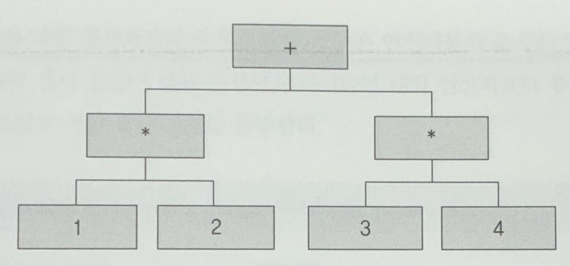

# 3. 구문 분석

구문 분석은 프로그래밍 언어로 작성하 소스 코드의 구조를 분석하는 과정이다. 소스 코드의 구조는 문과 식으로 구성된다. 문은 복합문과 단일문으로 구분되며 for문이나 if문 등과 같이 다른 문을 포함할 수 있는 문을 복합문이라 하고, return문이나 continue문과 같이 다른 문을 포함할 수 없는 문을 단일문이라 한다.

따라서 문은 문을 포함할 수 있다. 또한 if문의 조건식이나 return문의 반환식과 같이 문은 식도 포함할 수 있다. 

식 1 + 2 * 3 을 예로 들어보자. 연산자의 우선순위에 따라 가장 먼저 계산되어야 할 것은 곱셈이다. 따라서 덧셈 연산자는 곱셈 식 2 * 3 을 포함한다.

정리하면 문은 문과 식을 포함하고 식은 식을 포함한다. 구문 분석은 소스 코드 구조의 문과 식을 분석하는 것이다.

> 문(statement): 어떤 작업을 수행하도록 지시하는 코드의 최소 단위. 실행 결과는 있지만, 특정 값을 반환하지는 않는다. 즉 "수행되는 명령" 이다.

> 식(expression): 하나의 값을 생성하는 코드의 단위. 계산이나 함수 호출 결과 등, 평가 후에 값을 반환한다. 즉 "평가되어 결과를 반환하는 것" 이다.

## 3.1 구문 트리와 노드

소스 코드의 구조를 분석해 문과 식의 포함관계를 트리로 표현한 것을 구문 트리라 한다. 트리는 노드들의 부모 자식 관계로 구성되므로 구문 분석을 하기 위해 가장 먼저 해야 할 것은 구문 트리를 구성할 노드들을 정의하는 것이다.

가장 먼저 정의할 노드는 구문 트리의 루트 노드이자 소스 코드의 선언 영역을 표현하는 노드다. 유랭은 선언 영역에 함수의 정의만 작성할 수 있다.

Node.h 파일을 만들고, 노드를 정의한다.

Statement와 Expression은 모든 문 노드와 식 노드의 부모 노드다. 이후 정의하는 노드들은 문이나 식에 따라 두 노드 중 하나를 상속받는다.
```cpp
struct Statement {};
struct Expression {};
```

함수 노드는 함수의 정의를 표현한다. 함수 이름, 매개 변수 이름 리스트, 실행할 문 리스트를 멤버로 가진다. (함수의 정의는 값을 반환하지 않으므로 문(Statement) 이다)

프로그램 노드는 함수 노드의 리스트를 멤버로 가진다.
```cpp
struct Function : Statement {
  string name;
  vector<string> parameters;
  vector<Statement> block;
};
struct Program {
  vector<Function*> functions;
};
```

다음 노드는 return문을 표현한다. 반환식을 멤버로 가진다.
```cpp
struct Return: Statement {
  Expression* expression;
}
```

다음 노드는 변수의 선언을 표현한다. 변수의 이름과 초기화식을 멤버로 가진다.
```cpp
struct Variable: Statement {
  string name;
  Expression* expression;
};
```

다음 노드는 for문을 표현한다. 변수의 선언, 조건식, 증감식, 실행할 문 리스트를 멤버로 가진다.
```cpp
struct For: Statement {
  Variable* variable;
  Expression* condition;
  Expression* expression;
  vector<Statement*> block;
}
```

다음 두 노드는 break문과 continue문을 표현한다. 멤버는 갖지 않는다.
```cpp
struct Break: Statement {};
struct Continue: Statement {};
```

다음 노드는 if문을 표현한다. 조건식 리스트, 각 조건식의 결과가 참일 때 실행할 문 리스트의 리스트, 거짓일 때 실행할 문 리스트를 멤버로 가진다.
```cpp
struct If: Statement {
  vector<Expression*> conditions;
  vector<vector<Statement*>> blocks;
  vector<Statement*> elseBlock;
}
```

다음 노드는 print문과 printLine문을 표현한다. 개행 여부와 콘솔에 출력할 식 리스트를 멤버로 가진다.
```cpp
struct Print: Statement {
  bool lineFeed = false;
  vector<Expression*> arguments;
}
```

다음 노드는 식의 문을 표현한다. 식은 항상 결과값을 남기는데 문에 속한 식의 결과값은 문의 목적에 따라 소비된다. 예를 들어 return 1 + 2; 라는 return 문에 속한 1 + 2의 결과값 3은 반환되어 소비된다. 또한 print(1 + 2); 라는 print문에 속한 식 1 + 2의 결과값 3도 출력되어 소비된다.

하지만 문에 포함되지 않은 식 1 + 2의 결과값 3은 그저 결과값일 뿐이다. 또한 함수를 호출한 후 반환값을 사용하지 않는 경우에도 마찬가지다. 이렇게 소비되지 않는 식의 결과값을 임의로 소비시키기 위해 식을 감싸는 문 노드가 필요하다.
```cpp
struct ExpressionStatement: Statement {
  Expression* expression;
};
```

다음 두 노드는 논리 연산자 or와 and를 표현한다. 논리 연산자는 이항 연산자이므로 왼쪽 식과 오른쪽 식을 멤버로 가진다. lhs는 왼쪽이라는 Left Hand Side의 약자이고, rhs는 오른쪽이라는 Right Hand Side의 약자이다.
```cpp
struct Or: Expression {
  Expression* lhs;
  Expression* rhs;
};
struct And: Expression {
  Expression* lhs;
  Expression* rhs;
}
```
논리 연산자 or와 and를 구분한 이유는 단락 평가 때문이다. false and () 는 왼쪽 식이 거짓이므로 오른쪽 식은 평가되지 않는다. 마찬가지로 true or () 는 왼쪽 식이 참이므로 오른쪽 식은 평가되지 않는다. 따라서 항상 양쪽 식을 모두 평가하는 관계 연산자와 산술 연산자와는 동작이 다르다.

다음 두 노드는 관계 연산자와 산술 연산자를 포함한다. 관계 연산자에는 ==, != 등이 있으며, 마찬가지로 산술 연산자에도 +, - 등 여러 종류가 있으므로 두 노드는 연산자의 종류를 멤버로 가진다. 또한 두 연산자 모두 이항 연산자이므로 왼쪽 피연산자 식과 오른쪽 피연산자 식을 멤버로 가진다.
```cpp
struct Relational: Expression {
  Kind kind;
  Expression* lhs;
  Expression* rhs;
};
struct Arithmetic: Expression {
  Kind kind;
  Expression* lhs;
  Expression* rhs;
};
```

다음 노드는 단항 연산자를 표현한다. 단항 연산자에는 절댓값을 구하는 +와 부호를 반전하는 -가 있으므로 연산자의 종류를 멤버로 갖고, 단항 연산자이므로 하나의 피연산자 식을 멤버로 갖는다. +연산자는 다른 언어들과 다르게 절댓값 연산자이다.
```cpp
struct Unary: Expression {
  Kind kind;
  Expression* sub;
};
```

다음 노드는 함수의 호출을 표현하는 식이다. 피연산자 식과 인자식 리스트를 멤버로 가진다.
```cpp
struct Call: Expression {
  Expression* sub;
  vector<Expression*> arguments;
};
```

다음 노드는 배열과 맵의 원소의 참조를 표현한다. 피연산자 식과 인덱스 식을 멤버로 가진다. array[0] 이나 map["property"] 같은 식을 표현한다.
```cpp
struct GetElement: Expression {
  Expression* sub;
  Expression* index;
};
```

다음 노드는 배열과 맵의 원소의 수정을 표현한다. 피연산자 식, 인덱스 식, 초기화식을 멤버로 가진다. array[0] = 3; 이나 map["property"] = 3; 과 같은 식을 표현한다.
```cpp
struct SetElement: Expression {
  Expression* sub;
  Expression* index;
  Expression* value;
};
```

다음 노드는 변수의 참조를 표현한다. 변수의 이름을 멤버로 가진다. Call 구조체와 GetElement, SetElement 구조체에서의 sub에 저장될 수 있다.
```cpp
struct GetVariable: Expression {
  string name;
};
```

다음 노드는 변수의 수정을 표현한다. 변수의 이름과 초기화식을 멤버로 가진다.
```cpp
struct SetVariable: Expression {
  string name;
  Expression* value;
};
```

다음 노드들은 순서대로 널 리터럴, 불리언 리터럴, 숫자 리터럴, 스트링 리터럴을 표현한다. 널 리터럴을 제외하고, 자신의 타입에 맞는 값을 멤버로 가진다.
```cpp
struct NullLiteral: Expression {};
struct BooleanLiteral: Expression {
  bool value = false;
};
struct NumberLiteral: Expression {
  double value = 0.0;
};
struct StringLiteral: Expression {
  string value;
};
```

다음 노드는 배열 리터럴을 표현한다. 원소식 리스트를 멤버로 가진다. [1, 2, 3]과 같은 리터럴 값을 표현한다.
```cpp
struct ArrayLiteral: Expression {
  vector<Expression*> values;
};
```

다음 노드는 맵 리터럴을 표현한다. 문자열과 원소식을 쌍으로 하는 맵을 멤버로 가진다. ["a": 1, "b": 2, "c": 3] 과 같은 리터럴 값을 표현한다.
```cpp
struct MapLiteral: Expression {
  map<string, Expression*> values;
};
```

## 3.2 구문 분석기

구문 분석은 문과 식으로 구성된 소스 코드의 구조를 분석하는 것이고, 구문 트리는 분석된 소스 코드의 구조를 표현하는 트리 자료구조다. 구문 분석기는 소스 코드의 구문을 분석하는 프로그램을 뜻하므로 토큰 리스트를 입력받아 구문 트리를 출력한다.

구분 분석을 하는 parse() 함수를 Main.cpp 파일에 추가한다.

```cpp
auto main() -> int {
  string sourceCode = R"""(
    func main() {
      printLine("Hello, World!"); // print Hello, World
      printLine(1 + 2 * 3); // arithmetic calculation
    }
  )""";
  vector<Token> tokenList = scan(sourceCode);
  Program* syntaxTree = parse(tokenList);

  printSyntaxTree(syntaxTree);
}
```

### 3.2.1 선언 영역

기본적으로 parse() 함수에서는 토큰 리스트를 처음부터 끝까지 토큰 단위로 순회하며 구문 트리를 구성해 나간다. 어휘 분석에서 현재 문자가 널 문자가 아닐 때까지 순회를 한 것처럼 구문 분석에서도 현재 토큰이 EndOfToken 토큰이 아닐 때ㅐ까지 순회를 하고, 순회가 끝나면 구문 트리의 루트 노드를 반환한다.

코드는 다음과 같다.
```cpp
static vector<Token>::iterator current;

auto parse(vector<Token>& tokens) -> Program* {
  Program* result = new Program();
  current = tokens.begin();
  while (current->kind != Kind::EndOfTokenList) {
  }
  return result;
}
```
위 코드를 보면 전역변수 current가 매개변수로 받은 토큰 리스트의 첫 번째 토큰을 가리키도록 하는 것을 볼 수 있다. while문에서는 현재 토큰이 무엇이냐에 따라 행동을 달리한다. 기본적으로 선언 영역에 올 수 없는 토큰인 경우에는 오류 메시지를 출력하며 구문 분석을 종료한다. 유랭은 선언 영역에 함수의 정의만 올 수 있다.

다음 코드와 같이 while문 내에서 현재 토큰이 무엇인지 확인하고, Function 토큰인 경우 parseFunction() 을 호출하여 functions 에 추가한다.

```cpp
auto parse(vector<Token>& tokens) -> Program* {
  Program* result = new Program();
  current = tokens.begin();
  while (current->kind != Kind::EndOfTokenList) {
    switch (current->kind) {
    case Kind::Function: {
      result->functions.push_back(parseFunction());
      break;
    }
    default: {
      cout << *current << " is wrong." << endl;
      exit(1);
    }
    }
  }
  return result;
}
```

함수의 정의를 분석하는 parseFunction() 함수가 호출된 시점에 현재 토큰은 Function이다. 그런데 Function 토큰은 함수 정의의 시작을 나타내는 토큰일 뿐이므로 토큰을 버린다.
```cpp
auto parseFunction() -> Function* {
  Function* result = new Function();
  skipCurrent(Kind::Function);
}
```

위 코드에서 호출한 skipCurrent() 보조함수는 매개변수로 받은 토큰이 현재 토큰과 같지 않으면 프로그램을 종료하고, 같으면 현재 토큰을 건너 뛴다. 코드는 다음과 같다.
```cpp
static auto skipCurrent(Kind kind) -> void {
  if (current->kind != kind) {
    cout << toString(kind) << " is required." << endl;
    exit(1);
  }
  ++current;
}
```

function 키워드 다음에는 함수의 이름이 오기 때문에 현재 토큰의 문자열을 앞서 생성했는 함수 노드에 설정하고 현재 토큰을 건너 뛴다.
```cpp
result->name = current->str;
skipCurrent(Kind::Identifier);
```

함수의 이름 뒤에는 괄호로 감싸진 매개변수 목록이 나오고, 매개변수 목록은 콤마로 구분된다. 괄호나 콤마와 같은 구분자, var 키워드는 건너 뛰면서 매개변수들의 이름을 함수 노드의 매개변수 리스트에 추가한다. 이후 오른쪽 괄호, 여는 중괄호도 건너뛴다.
```cpp
static auto parseFunction() -> Function* {
  Function* result = new Function();
  skipCurrent(Kind::Function);
  result->name = current->str;
  skipCurrent(Kind::Identifier);
  skipCurrent(Kind::LeftParen);
  if (current->kind != Kind::RightParen) {
    do {
      skipCurrent(Kind::Variable);
      result->parameters.push_back(current->str);
      skipCurrent(Kind::Identifier);
    } while (skipCurrentIf(Kind::Comma));
  }
  skipCurrent(Kind::RightParen);
}

static auto skipCurrentIf(Kind kind) -> bool {
  if (current->kind != kind) return false;
  ++current;
  return true;
}
```

이후에는 함수의 본문이 나온다. 함수의 본문 또한 괄호로 감싸져 있으므로 앞 뒤의 괄호는 건너뛰고 본문을 분석하는 parseBlock() 함수를 호출해 반환받은 본문의 문 리스트를 함수 노드에 저장한다.
```cpp
skipCurrent(Kind::RightParen);
skipCurrent(Kind::LeftBrace);
result->block = parseBlock();
skipCurrent(Kind::RightBrace);
return result;
```

### 3.2.3 본문

본문을 분석하는 parseBlock() 함수는 기보적으로 현재 토큰이 본문의 끝을 나타내는 '}'가 아닐 때까지 토큰 리스트를 순회하고, 순회가 끝나면 문 리스트를 반환한다.
```cpp
static auto parseBlock() -> std::vector<Statement*> {
  vector<Statement*> result;
  while (current->kind != Kind::RightBrace) {
  }
  return result;
}
```

지금까지와 동일하게 위 코드의 while문에서도 현재 토큰이 무엇이냐에 따라 행동이 결정된다. 함수의 정의와 같이 본문에 허용되지 않는 토큰이 나오면 오류 메시지를 출력하고 분석을 종료한다.

```cpp
switch(current->kind) {
case Kind::EndOfTokenList: {
  cout << *current << " is wrong." << endl;
  exit(1);
}
}
```

### 3.2.4 변수의 선언

본문에 올 수 있는 문들 중 변수의 선언을 살펴보자. 현재 토큰이 Variable이라면 변수의 선언을 분석하는 parseVariable() 함수를 호출하도록 switch 문에 조건을 추가한다.
```cpp
case Kind::Variable: {
  result.push_back(parseVariable());
  break;
}
```

다음은 parseVariable() 함수이다. Variable 토큰을 건너 뛰고, 현재 토큰의 문자열을 변수 선언 노드의 이름으로 설정한다.
```cpp
auto parseVariable() -> Variable* {
  Variable* result = new Variable();
  skipCurrent(Kind::Variable);
  result->name = current->str;
  skipCurrent(Kind::Identifier);
}
```

유랭은 항상 변수를 초기화하도록 강제한다. 따라서 변수의 이름 다음에는 무조건 대입 연산자가 나와야 한다. 이후 parseExpression() 함수를 호출해 반환받은 식 노드를 변수 선언 노드의 초기화 식으로 설정한다. 마지막으로는 현재 토큰이 세미콜론인지 확인한 후 변수 선언 노드를 반환하며 분석을 마친다.
```cpp
skipCurrent(Kind::Assignment);
result->expression(parseExpression());
skipCurrent(Kind::Semicolon);
return result;
```

### 3.5 본문의 식

변수의 선언이 var 키워드로 시작하듯이 for문은 for키워드로, if문은 if키워드로 시작한다. 따라서 시작을 표시하는 키워드가 있는 문들은 parseBlock() 함수의 switch문에 조건을 추가해 분석하면 된다.

하지만 식은 별도로 시작을 표시하는 키워드가 없으므로 현재 토큰이 특정 키워드들이 아닐 때를 식의 시작으로 간주한다.

parseExpressionStatement() 함수는 단순히 parseExpression() 함수를 호출해 식을 분석하고 반환받은 식 노드를 ExpressionStatement 노드로 감싸 반환한다.
```cpp
default: result.push_back(parseExpressionStatement()); break;

static auto parseExpressionStatement() -> ExpressionStatement* {
  ExpressionStatement* result = new ExpressionStatement();
  result->expression = parseExpression();
  skipCurrent(Kind::Semicolon);
  return result;
}
```

나머지 문을 분석하는 함수들도 이와 비슷하게 구현 가능하다.
아래는 완성된 parseBlock() 함수의 구현이다.
```cpp
static auto parseBlock() -> std::vector<Statement*> {
  vector<Statement*> result;
  while (current->kind != Kind::RightBrace) {
    switch (current->kind) {
    case Kind::EndOfTokenList:  cout << *current << " is wrong" << endl; exit(1);
    case Kind::Variable:        result.push_back(parseVariable()); break;
    case Kind::For:             result.push_back(parseFor()); break;
    case Kind::If:              result.push_back(parseIf());  break;
    case Kind::Print:
    case Kind::PrintLine:       result.push_back(parsePrint()); break;
    case Kind::Return:          result.push_back(parseReturn()); break;
    case Kind::Break:           result.push_back(parseBreak()); break;
    case Kind::Continue:        result.push_back(parseContinue()); break;
    default:                    result.push_back(parseExpressionStatement()); break;
    }
  }
  return result;
}
```

### 3.2.6 식

식에는 피연산자와 연산자가 있고, 연산자에는 단항 연산자와 이항 연산자가 있다. 이항 연산자에는 우선 순위가 있는데, 다음은 이항 연산자들의 우선 순위를 보여준다. 위쪽일수록 우선 순위가 높다.

1. 산술 * / % 연산자

2. 산술 + - 연산자

3. 관계 연산자 

4. 논리 and 연산자

5. 논리 or 연산자

6. 대입 연산자

우선순위가 낮은 대입 연산자가 가장 나중에 계산되고, 우선순위가 가장 높은 산술 연산자 중 곱하기, 나누기, 나머지 연산이 가장 먼저 계산된다. 그런데 구문트리는 자식 노드가 없는 잎 노드부터 차례로 계산하므로 우선순위가 낮은 연산자부터 분석해야 한다.

예를 들어 1 * 2 + 3 * 4 구문 트리는 다음과 같이 구성된다.



즉 우선순위가 높은 연산자는 먼저 계산되어야 하므로 우선순위가 높은 연산자일수록 루트 노드에서부터 멀리 자리해야 한다. 즉 우선순위가 가장 낮은 연산자부터 먼저 분석하면서, 우선순위가 높은 연산자를 이후에 분석해야한다.

따라서 식을 분석하는 parseExpression() 함수는 parseAssignment() 함수를 호출 해 우선순위가 가장 낮은 대입 연산자부터 분석을 시작한다. parseExpression() 함수는 다음과 같다.
```cpp
auto parseExpression() -> Expression* {
  return parseAssignment();
}
```

### 3.2.7 대입 연산자

대입 연산자는 이항 연산자이므로 두 개의 피연산자를 가진다. 둘 중 왼쪽 피연산자 식을 먼저 분석하는데, 대입 연산자보다 우선순위가 한 단계 더 높은 연산자는 or 연산자이므로, or 연산자를 분석하는 parseOr() 함수를 호출한다.
```cpp
auto parseAssignment() -> Expression* {
  Expression* result = parseOr();
}
```

다음 코드와 같이 왼쪽 식을 분석한 후 현재 토큰이 대입 연산자가 아니라면 parseOr() 함수가 반환한 식 노드를 그대로 반환하며 분석을 종료한다. 식의 분석은 우선순위가 가장 낮은 연산자부터 시작해 우선순위가 높은 연산자 순으로 분석하므로, 왼쪽 식의 분석이 끝난 시점에서 대입 연산자보다 우선순위가 더 높은 연산자들의 분석은 모두 끝난 상태가 된다. 따라서 현재 토큰이 대입 연산자가 아니라면 분석이 끝난 것임을 알 수 있다.
```cpp
if (current->kind != Kind::Assignment) {
  return result;
}
skipCurrent(Kind::Assignment);
```

대입 연산자의 왼쪽 식으로 올 수 있는 것은 참조가 가능한 변수다. 값을 수정할 수 없는 리터럴이나 함수 호출은 대입 연산자의 왼쪽 식으로 올 수 없으므로, 왼쪽 식이 변수 값의 참조를 표현하는 GetVariable 노드인지 확인한다.

dynamic_cast<GetVariable*>(result) : result가 GetVariable* 형이 아니면 nullptr, 맞다면 변환하여준다.
```cpp
if(GetVariable* getVariable = dynamic_cast<GetVariable*>(result)) {
}
```

왼쪽 식이 변수 값의 참조를 표현하는 GetVariable 노드라면, 변수 값의 수정을 표현하는 SetVariable 노드를 생성해 반환하며 분석을 종료한다. SetVariable 노드의 변수명은 GetVariable 노드의 변수명으로 설정하고, SetVariable 노드의 식은 parseAssignment() 함수를 재귀 호출해 설정한다.

parseAssignment() 함수를 호출하는 이유는 대입연산자가 연달아 있을 때의 결합 방향은 오른쪽에서 왼쪽이기 때문이다.

예를 들어 a = b = 3; 이라는 식이 있을 때 b = 3 이 먼저 수행되고, 그 결과값이 반영되어 a = 3 이 계산된다.
```cpp
SetVariable* result = new SetVariable();
result->name = getVariable->name;
result->value = parseAssignment();
return result;
```

대입 연산자의 왼쪽 식에 올 수 있는 것에는 배열이나 맵의 원소 참조도 있으므로, 왼쪽 식이 원소 참조를 표현하는 GetElement 노드인지 확인한다.
```cpp
if(GetElement* getElement = dynamic_cast<GetElement*>(result)) {
}
```

변수 참조와 마찬가지로 SetElement 노드를 생성해 반환하며 분석을 종료하는데, 반환하기 전에 SetElement 노드의 피연산자 식과 인덱스 식을 GetElement 노드의 피연산자 식과 인덱스 식으로 설정하고, 오른쪽 식은 대입 연산자를 분석하는 parseAssignment() 함수를 재귀 호출해 설정한다.
```cpp
SetElement* result = new SetElement();
result->sub = getElement->sub;
result->index = getElement->index;
result->value = parseAssignment();
return result;
```

대입 연산자의 왼쪽 식이 변수 참조도, 원소 참조도 아니라면 잘못된 식이므로 다음과 같이 오류 메시지를 출력하고 분석을 종료한다.
```cpp
cout << "Wrong assignment Expression" << endl;
exit(1);
```