# 4. 인터프리터

지금까지 소스 코드의 문자열을 분석하는 어휘 분석과 구조를 분석하는 구문 분석을 학습하였다.

즉 소스 코드의 문자열로부터 토큰 리스트를 만드는 방법을 학습하였고, 토큰 리스트로부터 구문 트리를 만드는 방법을 학습했다.

컴파일 과정을 두 부분으로 나누면 전단부와 후단부로 나눌 수 있는데, 구문 분석의 결과물인 구문 트리는 다음 그림과 같이 전단부와 후단부를 잇는 매개체다.

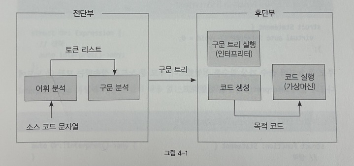

인터프리터란 소스 코드를 실행하는 프로그램을 말한다. 더 정확하게 표현하면 인터프리터는 구문 트리를 실행하는 프로그램이다. 즉 구문 트리를 순회하며 노드를 실행한다.

## 4.1 구문 트리 순회

인터프리터는 구문 트리를 순회하며 실행하는 프로그램이므로, 인터프리터를 만들기 위해 가장 먼저 해야 할 것은 구문 트리를 순회할 방법을 결정하는 것이다.

유랭 컴파일러는 단순하게 가상 함수를 사용해서 구문 트리를 순회한다. 구문 분석에서 작성했던 노드들에 가상 함수를 추가하자. 문 노드를 순회할 때는 interpret() 가상 함수를 호출해 구문 트리를 순회한다.
```cpp
struct Statement {
  virtual auto interpret() -> void = 0;
}
```

부모 문 노드에 순수 가상 함수를 선언했으므로, 부모 문 노드를 상속받는 모든 문 노드에 interpret() 함수를 선언한다.

식도 마찬가지이다. 다음과 같이 부모 식 노드에 interpret() 라는 순수 가상 함수를 선언하는데, 식은 결과값이 있으므로 반환값의 데이터 타입을 any로 선언한다. 식 노드를 순회할 때도 interpret() 가상 함수를 호출해 구문 트리를 순회한다.

마찬가지로 모든 식 노드를 상속받는 모든 식 노드에 interpret() 함수를 선언한다.
```cpp
struct Expression {
  virtual auto interpret() -> any = 0;
}
```

이후 Interpreter.cpp 파일에 작성한 함수들의 정의를 채워간다.

## 4.2 구문 트리 실행기

인터프리터는 구문 트리를 순회하며 실행하는 프로그램을 뜻하므로 구문 트리의 루트 노드를 입력받는다. 구문 트리를 실행하는 interpret() 함수를 Main.h 에 선언한다.
```cpp
auto interpret(Program*) -> void;
```

main() 에서는 구문 트리의 루트 노드를 인자로 넘겨 interpret() 함수를 호출한다.
```cpp
vector<Token> tokenList = scan(sourceCode);
Program* syntaxTree = parse(tokenList);
interpret(syntaxTree);
```

## 4.2.1 엔트리 포인트 함수 호출

구문 트리의 루트 노드이자 소스 코드의 선언 영역을 표현하는 프로그램 노드는 함수의 정의들을 포함한다. 유랭은 함수를 정의한 순서와 관계없이 호출할 수 있으므로 다음과 같이 functionTable이라는 전역 변수를 선언한다. functionTable은 함수의 이름과 함수의 노드를 키와 값으로 가진다. interpret() 함수에서는 프로그램 노드에 포함된 함수 노드들을 functionTable 변수에 등록한다.
```cpp
static map<string, Function*> functionTable;

auto interpret(Program* program) -> void {
  for (Function* node: program->functions) {
    functionTable[node->name] = node;
  }
}
```

정의된 함수들을 호출할 수 있도록 전역 변수에 등록했으니 이제 엔트리 포인트 함수를 실행해야 한다. 유랭의 엔트리 포인트는 main() 함수이므로 functionTable에서 키가 main으로 등록된 함수 노드를 찾아 interpret() 함수를 호출한다.
```cpp
if (functionTable.count("main") == ) {
  return;
}
functionTable["main"]->interpret();
```

## 4.2.2 함수

함수의 실행은 단순히 본문의 노드들을 순회하는 것이 전부다. 다음과 같이 함수 노드의 문 리스트를 순회하며 interpret() 함수를 호출함으로써 함수가 실행된다.
```cpp
auto Function::interpret() -> void {
  for (Statement* node: block) {
    node->interpret();
  }
}
```

## 4.2.3 print문

인터프리터는 소스 코드에 작성된 코드의 실행 흐름대로 노드들을 방문하므로 모든 모드의 interpret() 함수의 내용을 작성하지 않아도 구문 트리를 실행해 볼 수 있다. 콘솔에 "Hello, World!"를 출력하는 소스 코드를 실행할 수 있도록 해보자.

print문의 실행은 print문 노드가 가진 식 노드들을 순회하며 interpret() 함수를 호출하는 것으로 print 문의 실행은 끝이다.
```cpp
auto Print::interpret() -> void {
  for (Expression* node: arguments) {
    any value = node->interpret();
    cout << value;
  }
  if (lineFeed) cout << endl;
}
```

## 4.2.4 데이터 타입

유랭은 동적 타입 언어이므로 인터프리터에서 데이터 타입을 표현하기 위해 C++17에서 지원하는 any를 사용한다. any는 마치 동적 타입 언어처럼 어떤 타입의 데이터든 저장할 수 있도록 해준다. 

그런데 C++ 자체는 정적 타입 언어이므로 any 타입에 저장된 값을 사용하려면 어떤 타입의 데이터가 저장되어 있는지는 알아야 한다. any에 저장된 데이터 타입을 확인하는 것과 저장된 값의 데이터 타입으로 캐스팅하는 것은 매번 반복되므로 보조 함수를 만들어 사용한다.

에이터 타입과 관련된 보조 함수들은 Datatype.cpp 파일에 작성한다. is로 시작하는 함수는 any 타입에 들어있는 값의 타입이 무엇인지 확인하고, to로 시작하는 함수들은 any 타입에 들어있는 값을 캐스팅한다.

```cpp
auto isString(any value) -> bool {
  return value.type() == typeid(string);
}

auto toString(any value) -> string {
  return any_cast<string>(value);
}
```

식 노드의 interpret() 함수가 반환하는 값의 데이터 타입은 any다. 콘솔에 any 타입의 값을 출력하기 위해서는 저장된 값의 데이터 타입을 알아야 하므로 실제로 콘솔에 식 노드의 반환값을 출력하는 함수는 다음과 같다.
```cpp
auto operator<<(ostream& stream, any& vaue) -> ostream& {
  if (isString(value)) stream << toString(value);
  ...
}
```

## 4.2.5 문자열 리터럴

이제 문자열 리터럴 노드의 interpret() 함수만 작성하면 "Hello, World!" 프로그램을 실행할 수 있다. 문자열 리터럴 노드에서는 노드가 가진 문자열 값을 반환하기만 하면 된다.

Function 노드에서는 Statement 노드를 순회하며 interpret() 함수를 호출해주면 된다.
```cpp
auto StringLiteral::interpret() -> void {
  return value;
}

auto Function::interpret() -> void {
  for (Statement* node : block) {
    node->interpret();
  }
}
```

```cpp
func main() {
  printLine("Hello World!");
  // printLine("Hi");
  /*
  printLine("Hi");
  printLine("Hi");
  */
}
```

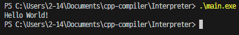

> // 한줄 주석, /* */ 여러줄 주석 기능도 추가하였다.

> 리눅스에서는 파일 복사시 수정시간 갱신하는데 윈도우에서는 수정시간 유지된다.
> 그래서 make 가 새롭게 빌드 안해준다 !!! 주의.

## 4.2.6 산술 연산

산술 연산자 노드는 왼쪽 식 노드와 오른쪽 식 노드를 멤버로 가진다. 연산을 하기 위해 양쪽 식 노드를 순회해서 두 피연산자의 값을 구한다.
```cpp
auto Arithmetic::interpret() -> any {
  any lValue = lhs->interpret();
  any rValue = rhs->interpret();
}
```

두 피연산자의 값을 구한 후에 할 일은 연산의 결과값을 반환하는 것이다. 연산자의 종류와 두 피연산자의 데이터 타입에 따라 연산을 하고 결과값을 반환한다. 예를 들어 연산자가 덧셈이고 두 피연산자의 데이터 타입이 숫자인 경우에는 덧셈을 해서 결과값을 반환한다.

마찬가지로 연산자가 덧셈이고 두 피연산자의 데이터 타입이 문자열이라면 다음과 같이 문자열 덧셈을 한다.
```cpp
if (kind == Kind::Add && isNumber(lValue) && isNumber(rValue)) {
  return toNumber(lValue) + toNumber(rValue);
}
if (kind == Kind::Add && isString(lValue) && isString(rValue)) {
  return toString(lValue) + toString(rValue);
}
```

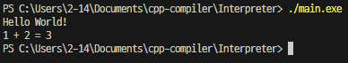

## 4.2.7 논리 연산

논리 연산자는 산술 연산자와 마찬가지로 두 개의 피연산자를 가지지만, 단락 평가가 되도록 interpret() 함수의 내용을 작성해야 한다.

다음 코드는 or 연산자 노드의 interpret() 함수이다.
```cpp
auto Or::interpret() -> any {
  return isTrue(lhs->interpret()) ? true : rhs->interpret();
}
```

다음 코드는 and 연산자 노드의 interpret() 함수이다.
```cpp
auto And::interpret() -> any {
  return isFalse(lhs->interpret()) ? false : rhs->interpret();
}
```

```cpp
func main() {
  printLine("Hello World!");
  print("1 + 2 = ");
  printLine(1 + 2);
  printLine(true or "Hello World!");
  printLine(false or "Hello World!");
  printLine(true and "Hello World!");
  printLine(false and "Hello World!");
}
```

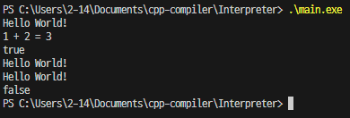

## 4.2.8 변수의 선언과 참조

지역변수는 선언된 위치에 따라 유효 범위가 달라진다. 블럭을 갖는 for문이나 if문을 떠올려보자. 블럭 밖에서 선언한 변수는 블럭 안에서 참조할 수 있지만, 반대로 블럭 안에서 선언한 변수는 블럭 밖에서 참조할 수 없다.

또한 a()라는 함수에서 선언한 변수는 b()라는 함수에서 참조할 수 없고 그 반대도 마찬가지다.

지역 변수의 유효 범위를 관리하고자 다음과 같은 데이터 타입의 전역 변수를 선언하자.
```cpp
static list<list<map<string, any>>> local;
```

이 전역변수의 데이터 타입에서 바깥쪽의 리스트는 함수의 블럭을 표현하고 안쪽의 리스트는 for문이나 if문 같은 문의 블럭을 표현한다. 그리고 맵에는 변수의 이름과 값을 키와 값으로 저장한다.

지역변수에 이어 전역변수를 관리하기 위한 전역변수도 선언하자. 유랭은 선언 영역에서 변수의 선언을 허용하지 않고, 함수 내에서 선언되지 않은 변수의 참조를 전역변수의 참조로 간주한다. 전역변수는 블럭과 관계없이 어디서든 참조가 가능하므로 다음과 같이 변수의 이름과 값을 저장할 맵을 선언한다.
```cpp
static map<string, any> global;
```

interpret() 함수에서는 유랭의 엔트리 포인트 함수인 main() 함수를 호출한다. 함수를 호출하기 전에 지역 변수를 관리하기 위한 local 전역 변수에 함수 공간을 추가해야 한다. 그리고 main() 함수가 종료되면 생성했던 지역 변수 공간을 제거해야 한다. 예외 처리 코드는 return문을 구현할 때 설명한다.
```cpp
try {
  local.emplace_back().emplace_front();
  functionTable["main"]->interpret();
} catch (ReturnException e) {
  local.pop_back();
}
```

위 코드에서 local 전역변수에 함수 블럭은 바깥쪽 리스트의 뒤에 추가되고, 문 블럭은 안쪽 리스트의 앞에 추가되는 것에 유의하자. 함수를 호출할 때마다 함수 블럭은 바깥쪽 리스트의 뒤에 추가되므로 현재 실행 중인 함수의 블럭은 항상 바깥쪽 리스트의 마지막에 있게 되고, for문이나 if문을 실행할 때마다 문 블럭은 안쪽 리스트의 앞에 추가되므로 현재 실행중인 문의 블럭은 항상 안쪽 리스트의 첫 번째에 있게 된다.

따라서 지역변수를 참조할 때에는 바깥쪽 리스트의 마지막 원소인 리스트에서 첫 번째 원소인 맵부터 마지막 원소인 맵까지를 찾으면 된다.

지역변수와 전역변수를 사용하기 위한 준비가 끝났으므로 변수의 선언을 표현하는 노드의 interpret() 함수를 작성한다. 변수의 이름과 초기화식의 결과값을 키와 값으로 local 전역 변수에 등록하면 된다.
```cpp
auto GetVariable::interpret() -> any {
  for (map<string, any>& variables: local.back()) {
    if (variables.count(name)) {
      return variables[name];
    }
  }
}
```

앞에서 유랭은 선언하지 않은 변수의 참조를 전역 변수로 간주한다고 했다. 변수의 선언을 local 전역 변수에서 찾지 못한다면 global 전역 변수에서도 찾기를 시도한다.
```cpp
if (global.count(name)) {
  return global[name];
}
```

> 선언하지 않은 변수의 참조를 전역변수로 간주한다는 것이 너무 마음에 안들어서, 전역 변수의 선언을 허용하도록 바꾸겠다. Program 노드에 vector<Variable*> variables 를 추가하여 전역변수를 담아주는 방식으로 바꾸겠다.

> 또 책에서는 없는 이름의 변수를 참조하면 null을 반환한다고 하였는데, 그냥 오류를 출력하고 종료하도록 바꾸겠다.

```cpp
// Node.h
struct Program {
  vector<struct Function*> functions;
  vector<struct Variable*> variables;
};

// Parser.cpp
auto parse(vector<Token>& tokens) -> Program* {
  Program* result = new Program();
  current = tokens.begin();
  while (current->kind != Kind::EndOfTokenList) {
    switch (current->kind) {
    case Kind::Function: {
      result->functions.push_back(parseFunction());
      break;
    }
    case Kind::Variable: {
      result->variables.push_back(parseVariable());
      break;
    }
    default: {
      cout << *current << " is wrong." << endl;
      exit(1);
    }
    }
  }
  return result;
}

// Interpreter.cpp
for (Variable* variable : program->variables) {
  if (functionTable.count(variable->name)) {
    cout << "Function name and global variable name are duplicated." << endl;
    exit(1);
  }
  global[variable->name] = variable->expression->interpret();
}
```

```cpp
var global = 4;

func main() {
  var local = 5;
  print(global, ", ", local);
}
```
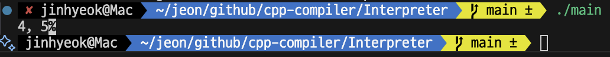

이제 변수와 관련해서 남은 것은 변수 값의 수정을 표현하는 노드다.
```cpp
auto SetVariable::interpret() -> any {
  for (map<string, any>& variables: local.back()) {
    if(variables.count(name)) {
      return variables[name] = value->interpret();
    }
  }
  if(global.count(name)) {
    return global[name] = value->interpret();
  }

  cout << name << " does not exist." << endl;
  exit(1);
}
```

아래는 전역 변수와 지역변수의 값을 수정하고 출력하는 코드이다.
```cpp
var global = 5;

func main() {
  var local = 10;
  
  printLine("global: ", global, ", local: ", local);

  global = 10;
  local = 5;

  printLine("global: ", global, ", local: ", local);
}
```

global = 10; 과 local = 5 는 각각 ExpressionStatement 노드로 감싸져 있으므로, 해당 노드의 interpret() 함수의 정의도 작성해야 올바르게 작동한다.
```cpp
auto ExpressionStatement::interpret() -> void {
  expression->interpret();
}
```

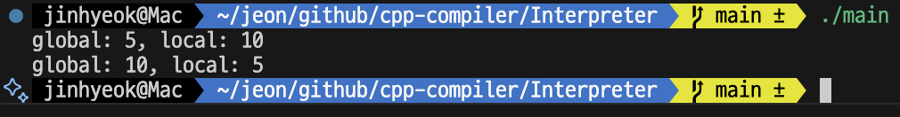

## 4.2.9 for문

for문은 블럭과 제어 변수를 가지는데 제어 변수의 유효 범위는 블럭에 종속된다. 따라서 제어 변수의 유효 범위가 블럭에 종속된다. 따라서 제어 변수의 유효 범위가 블럭 안에 종속될 수 있도록 문 블럭을 먼저 생성한 후 제어 변수를 등록해야 한다.

이어서 for문은 반복문이므로, 본문을 반복해서 실행할 무한 루프를 작성하고, 본문의 실행이 끝나면 앞서 생성했던 문 블럭을 제거하도록 코드를 작성한다.
```cpp
auto Variable::interpret() -> void {
  if (functionTable.count(name)) {
    cout << "Function name and local variable name are duplicated." << endl;
    exit(1);
  }
  local.back().front()[name] = expression->interpret();
}

auto For::interpret() -> void {
  local.back().emplace_front();
  variable->interpret();

  while(true) {

  }
  local.back.pop_front();
}
```

for문의 전체 구조를 잡았으니 남은 것은 무한 루프 안에서 조건식이 거짓이 아닐 때까지 본문을 반복 실행하도록 하는 것이다.

조건은 본문을 실행하기 전마다 평가되므로 먼저 조건식 노드를 순회해 결과가 거짓이라면 무한 루프를 탈출하도록 하고, 아니라면 본문의 문 노드들을 순회해 실행한다. 그리고 for문의 증감식은 본문의 실행이 끝났을 때마다 평가되므로 본문의 실행이 끝나면 증감식 노드를 순회한다.
```cpp
any result = condition->interpret();
if(isFalse(result)) {
  break;
}
for(Statement* node: block) {
  node->interpret();
}
expression->interpret();
```

```cpp
func main() {
  for(var i = 0; i < 5; ++i) {
    printLine(i);
  }
}
```

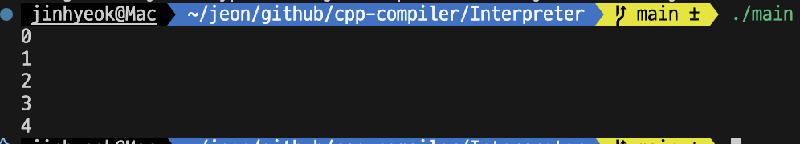

> ++i 를 구현하기 위해 Node.h, Parser.cpp, Interpreter.cpp 를 조금 수정하였다.
```cpp
// Node.h
struct Unary : Expression {
  Kind kind;
  string name; // 추가한 부분
  Expression* sub;
  auto interpret() -> any;
};

// Parser.cpp
static auto parseUnary() -> Expression* {
  set<Kind> operators1 = { Kind::Add, Kind::Subtract };
  set<Kind> operators2 = { Kind::Increase, Kind::Decrease };
  if (operators1.count(current->kind)) {
    Unary* result = new Unary();
    result->kind = current->kind;
    skipCurrent();
    result->sub = parseOperand();
    return result;
  }
  else if (operators2.count(current->kind)) { // 추가한 부분
    Unary* result = new Unary();
    result->kind = current->kind;
    skipCurrent();
    result->name = current->str;
    skipCurrent(Kind::Identifier);
    return result;
  }
  return parseOperand();
}

// interpreter.cpp
auto Unary::interpret() -> any {
  set<Kind> operators1 = { Kind::Add, Kind::Subtract };
  set<Kind> operators2 = { Kind::Increase, Kind::Decrease };

  if (operators1.count(kind)) {

  }
  else { // 추가한 부분
    if (kind == Kind::Increase) {
      for (map<string, any>& variables : local.back()) {
        if (variables.count(name)) {
          return variables[name] = toNumber(variables[name]) + 1;
        }
      }
      if(global.count(name)) {
        return global[name] = toNumber(global[name]) + 1;
      }
      cout << name << " does not exist." << endl;
      exit(1);
    }
    if (kind == Kind::Decrease) {
      for (map<string, any>& variables : local.back()) {
        if (variables.count(name)) {
          return variables[name] = toNumber(variables[name]) - 1;
        }
      }
      if(global.count(name)) {
        return global[name] = toNumber(global[name]) - 1;
      }
      cout << name << " does not exist." << endl;
      exit(1);
    }
  }
}
```

기존 Unary 노드에 string name 을 추가하여, ++ 또는 --이 온 경우에는 뒤에 따라오는 Identifier의 이름을 name에 저장하여 노드로 만들었다.

이후 Unary 노드의 interpret() 함수를 수행하면서, 만약 kind가 Increase 또는 Decrease 이라면, 해당 변수의 값을 1 늘리거나 줄여주고 그 값을 반환하도록 하였다.

## 4.2.10 if문

이번에는 제어문 중 조건문인 if문이 동작하도록 한다. if문에는 if절과 elif절에 포함된 하나 이상의 조건식이 있으므로 다음과 같이 조건식의 개수만큼 루프를 도는 것을 시작한다.

if문은 조건식의 결과가 참인 경우에 본문을 실행하므로 다음과 같이 조건식 노드를 순회해 결과가 거짓이면 본문을 실행하지 않도록 한다.
```cpp
auto If::interpret() -> void {
  for (auto i = 0; i < conditions.size(); ++i) {
    any result = conditions[i]->interpret();
    if (isFalse(result)) {
      continue;
    }
  }
}
```

반대로 조건식의 결과가 참이라면 본문을 실행하도록 하는데, if문에 포한된 각각의 절은 문 블럭이므로 본문을 실행하기 전에 문 블럭을 생성하고, 블럭의 실행이 끝나면 생성했던 문 블럭을 제거한다.

또한 본문을 실행한 후에는 다른 elif 절의 본문이 실행되지 않도록 if문의 실행을 종료하도록 한다.
```cpp
local.back().emplace_front();
for (Statement* node: blocks[i]) {
  node->interpret();
}
local.back().pop_front();
return;
```

모든 조건식의 결과가 거짓일 때 else절이 있다면 els문의 본문을 실행하고, 없다면 종료한다.
```cpp
if(elseBlock.empty()) return;

local.back().emplace_front();
for (Statement* node: elseBlock) {
  node->interpret();
}
local.back().pop_front();
```

아래는 Relational의 interpret() 함수 구현이다.
```cpp
auto Relational::interpret() -> any {
  any lValue = lhs->interpret();
  any rValue = rhs->interpret();
  if (isNumber(lValue) && isNumber(rValue)) {
    double l = toNumber(lValue), r = toNumber(rValue);
    switch (kind) {
    case Kind::LessThan:       return l < r;
    case Kind::LessOrEqual:    return l <= r;
    case Kind::GreaterThan:    return l > r;
    case Kind::GreaterOrEqual: return l >= r;
    case Kind::Equal:          return l == r;
    case Kind::NotEqual:       return l != r;
    }
  }
  else if (isBoolean(lValue) && isBoolean(rValue)) {
    bool l = toBoolean(lValue), r = toBoolean(rValue);
    switch (kind) {
    case Kind::Equal:    return l == r;
    case Kind::NotEqual: return l != r;
    }
  }
  cout << lValue << " " << toString(kind) << " " << rValue << " is impossible" << endl;
  exit(1);
}
```

```cpp
func main() {
  for(var i = 0; i < 5; ++i) {
    if(i == 1) {
      printLine("One");
    }
    elif(i == 2) {
      printLine("Two");
    }
    elif(i == 3) {
      printLine("Three");
    }
    else {
      printLine(i);
    }
  }
}
```
아래는 if문의 테스트이다.

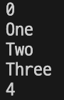

## 4.2.11 continue문

이번에는 for문에서 continue문이 동작하도록 한다. 실행 흐름을 제어하는 continue문의 실행은 콜 스택을 역행하도록 예외 처리를 사용하면 간단하게 구현할 수 있다.

먼저 다음과 같이 예외 처리에 사용할 continue 예외 객체를 정의한다. continue문은 값을 전달하지 않으므로 멤버 변수는 없다.
```cpp
struct ContinueException {};
```

Continue 노드의 interpret() 함수에서는 continue 예외 객체를 던지기만 하면 된다.
```cpp
auto Continue::interpret() -> void {
  throw ContinueException();
}
```

for문에서의 continue 처리는, 본문의 문 리스트를 순회하는 코드를 다음과 같이 try문으로 감싸기만 하면 된다.
```cpp
try {
  for (Statement* node: block) {
    node->interpret();
  }
} catch (ContinueException&) {}
```

break문도 마찬가지로 break 예외 객체를 정의하고 break문을 표현하는 노드에서 예외를 던저 for문에서 받아 처리하면 된다.
```cpp
try {
  for (Statement* node: block) {
    node->interpret();
  }
}
catch (ContinueException) {}
catch (BreakException) { break; }
```

아래는 continue문과 break 문의 테스트이다.
```cpp
func main() {
  for(var i = 0; i < 5; ++i) {
    if(i == 0) {
      printLine("Zero");
    }
    if(i == 1) {
      continue;
    }
    elif(i == 2) {
      printLine("Two");
    }
    elif(i == 3) {
      break;
    }
    else {
      printLine(i);
    }
  }
}
```
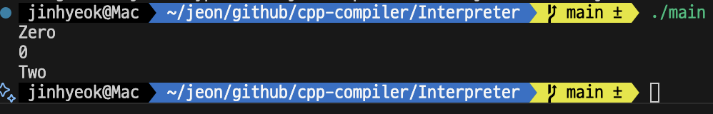

## 4.2.12 함수 호출

이제 값도 사용할 수 있고, 변수도 사용할 수 있고, 콘솔에 값이나 변수를 출력할 수도 있고, 반복문과 조건문도 사용할 수 있다. 프로그래밍 언어로서 필수적이고 기초적인 기능들을 사용할 수 있도록 했는데, 함수 역시 프로그램을 만들기 위해 꼭 필요한 기능이다.

함수는 호출을 할 수 있고, 호출하면서 인자를 넘길 수도 있고, 결과값을 반환할 수도 있고, 프로그래밍 언어가 제공하는 내장 함수도 있다.

함수와 관련된 기능들 중 첫 번째로 해야 할 것은 함수의 호출이다.

함수를 호출하는 것은 식이고 함수의 이름으로 호출하므로, GetVariable 노드의 interpret() 함수에 식별자의 이름으로 전역 변수의 functionTable을 검색해서 같은 이름을 등록된 함수 노드를 찾아 반환하도록 한다.

변수의 참조를 표현하는 노드에서 함수 노드를 반환하도록 했으니, 이제 해야 할 일은 반환받은 함수 노드를 호출하는 것이다. 함수의 호출을 표현하는 노드의 interpret() 함수에서 다음과 같은 코드를 추가한다.
```cpp
auto Call::interpret() -> any {
  any value = sub->interpret();
  if (!isFunction(value)) {
    cout << "Syntax error" << endl;
    exit(1);
  }
}
```

> 여기서는 Call 노드에서 함수의 이름을 GetVariable 노드로 저장하는데, 이 방식은 이상한것 같다. 나는 Call 노드에서 함수의 이름을 저장하는 string name 변수를 만들고, 파싱할 때 함수의 이름을 name에 저장하도록 고치겠다.

아래는 Node.h 와 Parser.cpp 를 고친 내용이다.
```cpp
// Node.h
struct Call : Expression {
  // Expression* sub
  string name;
  vector<Expression*> arguments;
  auto interpret() -> any;
};

// Parser.cpp
static auto parseCall(Expression* sub) -> Expression* {
  Call* result = new Call();
  GetVariable* var = dynamic_cast<GetVariable*>(sub);
  if (!var) {
    cout << "Syntax error." << endl;
    exit(1);
  }
  result->name = var->name;
  skipCurrent(Kind::LeftParen);
  if (current->kind != Kind::RightParen) {
    do result->arguments.push_back(parseExpression());
    while (skipCurrentIf(Kind::Comma));
  }
  skipCurrent(Kind::RightParen);
  return result;
}
```

이렇게 하면 책의 Call::interpret() 에서의 괴상한(?) 코드가 깔끔하게 바뀐다.
```cpp
// 책의 코드
auto Call::interpret() -> any {
  auto value = sub->interpret();
  if (isFunction(value) == false) {
    return nullptr;
  }
  ...
}

// 바뀐 코드
auto Call::interpret() -> any {
  if (functionTable.count(name)) {
    local.emplace_back().emplace_front();
    functionTable[name]->interpret();
    local.pop_back();
    return nullptr;
  }
  cout << "There is no function " << name << endl;
  exit(1);
}
```

함수는 함수 블럭을 가지므로 함수를 호출하기 전에 전역 변수 local에 함수 블럭을 생성하고, 호출이 끝나면 생성했던 함수 블럭을 제거해야 한다. 그리고 지금은 함수가 반환값을 반환하지 않으므로 임시로 널을 반환하도록 한다.

아직 함수에 인자를 넘길 수도 없고, 함수에서 값을 반환할 수도 없지만 호출은 가능하다.

아래는 함수 호출 테스트이다.
```cpp
func main() {
  sayHoHoHo();
}

func sayHoHoHo() {
  print("Ho! Ho! Ho!");
}
```

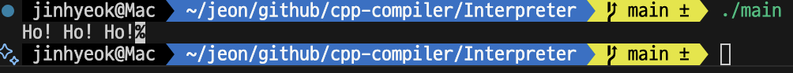

## 4.2.13 함수 호출 인자

이어서 인자와 함께 함수를 호출할 수 있도록 만들어보자. 인자와 함께 함수를 호출하기 위해서는 인자값들이 필요하다. 함수의 호출을 표현하는 노드에서 인자식 노드 리스트를 순회해 인자값들을 구하고, 매개 변수의 이름과 인자값을 매핑시켜 보관한다.

이후 함수 블럭에 인자값들을 넣어놓고 함수를 호출하는 방법으로 구현한다.
```cpp
auto Call::interpret() -> any {
  if (functionTable.count(name)) {
    Function* func = functionTable[name];
    map<string, any> parameters;
    for (int i = 0; i < arguments.size(); ++i) {
      string name = func->parameters[i];
      parameters[name] = arguments[i]->interpret();
    }
    // local.emplace_back().emplace_front();
    local.emplace_back().push_front(parameters);
    functionTable[name]->interpret();
    local.pop_back();
    return nullptr;
  }
}
```

이제 함수 내에서 매개변수의 이름으로 인자값을 참조할 수 있다. 다음은 함수에 인자를 넘기는 테스트이다.
```cpp
func main() {
  sayHoHoHo(3);
  add(5.2, 8.3);
}

func sayHoHoHo(var num) {
  for(var i = 0; i < num; ++i) {
    printLine("Ho! Ho! Ho!");
  }
}

func add(var a, var b) {
  printLine(a + b);
}
```
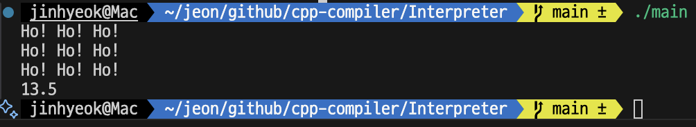

## 4.2.14 return 문

이어서 함수가 값을 반환할 수 있도록 만들자. 지금 함수는 항상 널을 반환하는데, continue문을 구현했던 것과 동일한 방법으로 return문을 구현할 수 있다. 예외 처리를 사용할 것이므로 return 예외 객체를 정의하고, return문은 값이 있으므로 any 타입의 멤버 변수를 하나 갖는다.
```cpp
struct ReturnException {
  any result;
};

auto Return::interpret() -> void {
  throw ReturnException{ expression->interpret() };
}
```

이제 함수의 호출을 표현하는 노드에서 return문 노드가 던진 return 예외를 받아 처리하면 된다.
추가로 함수에 넘긴 인자 수와 매개변수 수가 일치하는지 확인하는 코드도 추가하였다.

```cpp
if (functionTable.count(name)) {
    Function* func = functionTable[name];
    map<string, any> parameters;
    if (func->parameters.size() != arguments.size()) {
      cout << "The number of arguments to the function is incorrect." << endl;
      exit(1);
    }
    for (int i = 0; i < arguments.size(); ++i) {
      string name = func->parameters[i];
      parameters[name] = arguments[i]->interpret();
    }
    // local.emplace_back().emplace_front();
    local.emplace_back().push_front(parameters);
    try {
      functionTable[name]->interpret();
    }
    catch (ReturnException& exception) {
      local.pop_back();
      return exception.result;
    }
    local.pop_back();
    return nullptr;
  }
```