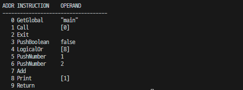
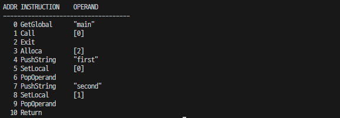
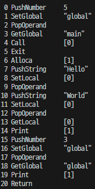
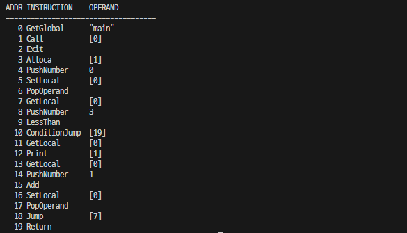
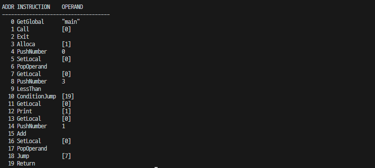
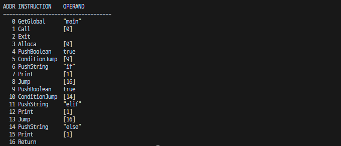

# 5. 코드 생성

코드 생성은 목적 코드를 생성하는 과정이다. 목적 코드는 소스 코드와 반대되는 개념으로, 소스 코드는 사람이 읽을 수 있는 문자열 형태의 코드인 반면에 목적 코드는 기계가 읽을 수 있는 바이너리 형태의 코드다.

목적 코드를 생성하는 주된 이유는 실행 속도 때문이다. 구문 트리와 같은 비선형 자료구조의 순회는 배열이나 리스트와 같은 선형 자료 구조의 순회에 비해 느리다. 

따라서 구문 트리가 담고 있는 내용을 그대로 선형 구조로 표현한다면 실행 속도를 높일 수 있따.

인터프리터가 일관된 규칙에 따라 노드들을 순서대로 순회하고 실행했으므로, 구문 트리를 선형 구조로 표현하는 것도 가능하다. 코드 생성은 비선형 구조인 구문 트리의 내용을 선형 구조로 표현하는 것이다.

## 5.1 목적 코드와 명령어

소스코드가 프로그래밍 언어로 작성한 코드인 반면에 목적 코드는 기계가 제공하는 명령어로 작성한 코드다. 안드로이드용으로 만든 프로그램이 다른 기계에서 동작하지 않는 이유는 기계들이 저마다 서로 다른 명령어를 제공하기 때문이다.

이 책에서는 가상머신을 대상으로 목적 코드를 생성한다. 가상머신은 물리 머신과 반대되는 개념으로 하드웨어 동작을 소프트웨어로 구현한 프로그램을 말한다.

자바 컴파일러가 자바 가상머신을 대상으로 목적 코드를 생성하듯이, 유랭 컴파일러는 유랭 가상머신을 대상으로 목적 코드를 생성한다.

그러면 유랭 가상머신의 명령어를 정의하자.
```cpp
enum class Instruction {
  Exit,
  Call, Alloca, Return,
  Jump, ConditionJump,
  Print, PrintLine,

  LogicalOr, LogicalAnd,
  Multiply, Divide, Modulo,
  Equal, NotEqual,
  LessThan, GreaterThan,
  LessOrEqual, GreaterOrEqual,
  Add, Subtract,
  Absolute, ReverseSign,

  GetElement, SetElement,
  GetGlobal, SetGlobal,
  GetLocal, SetLocal,

  PushNull, PushBoolean,
  PushNumber, PushString,
  PushArray, PushMap,
  PopOperand
};
```
위에 열거형으로 정의된 명령어들을 보면 대부분 설명이 따로 필요 없을 만큼 익숙한 단어들이 나열된 것을 볼 수 있다. 물리 머신에 비해 가상머신의 명령어는 높은 레벨로 추상화가 가능하기 때문이다.

- Exit(프로그램 종료)
- Call(함수 호출): 호출하는 함수에 넘길 인자의 개수를 인자로 가진다
- Alloca(메모리 할당): 호출된 함수의 지역 변수들의 값을 저장할 메모리 공간을 확보한다. 지역 변수 개수를 인자로 가진다.
- Return(함수 종료): 함수의 결과값을 반환하며 함수를 종료한다.
- Jump(분기): C++의 goto문과 같다. 점프할 코드의 주소를 인자로 가진다.
- ConditionJump(조건 분기): if문과 for문의 조건식의 결과가 거짓인 경우에 분기한다. 점프할 코드의 주소를 인자로 가진다.
- Print, PrintLine(콘솔 출력): 피연산자 스택에서 값을 꺼내 콘솔에 출력한다. 콘솔에 출력할 값의 개수를 인자로 가진다.
- LogicalOr, LogicalAnd(논리 연산): 순서대로 논리or, and 연산자이지만 단락 평가를 하므로 조건 분기 명령처럼 동작한다. 점프할 코드의 주소를 인자로 가진다.
- Add, Subtract, Multiply, Divide, Modulo(산술 연산): 순서대로 + - * / % 연산자다.
- Equal, NotEqual, LessThan, GreaterThan, LessOrEqual, GreaterOrEqual(비교 연산): 순서대로 ==, !=, <, >, <=, >= 연산자다.
- Absolute, ReverseSign(단항 연산): 순서대로 +, - 연산자다. 절대값 연산과 부호 반전 연산을 한다.
- GetElement, SetElement(원소 연산): 순서대로 원소값의 참조와 수정 연산을 하는 맵과 배열의 [] 인덱스 연산이다.
- GetGlobal, SetGlobal(전역 변수 연산): 순서대로 전역 변수 값의 참조와 수정 연산을 한다. GetGlobal은 전역 변수의 값을 피연산자 스택에 넣는다. SetGlobal은 대입 연산자와 같다. 전역 변수의 이름을 인자로 가진다.
- GetLocal, SetLocal(지역 변수 연산): 순서대로 지역 변수 값의 참조와 수정 연산을 한다. GetLocal은 지역 변수의 값을 피연산자 스택에 넣는다. SetLocal은 대입 연산자와 같다. 지역 변수의 오프셋을 인자로 가진다.
- PushNull, PushBoolean, PushNumber, PushString(프리미티브 타입 리터럴 연산): 순서대로 널, 불리언, 숫자, 문자열 값을 피연산자 스택에 넣는다. 데이터 타입에 따른 리터럴 값을 인자로 갖는다.
- PushArray, PushMap(레퍼런스 타입 리터럴 연산): 순서대로 배열과 맵을 생성해 피연산자 스택에 넣는다. 생성할 배열이나 맵의 원소의 개수를 인자로 가진다. 원소의 개수만큼 피연산자 스택에서 값을 꺼내 배열이나 맵을 생성한다.
- PopOperand(피연산자 스택 연산): 피연산자 스택에서 값을 꺼내 버린다.

명령어는 역할에 따라 인자를 가지므로 명령어와 인자를 묶어 다음과 같이 목적 코드를 표현할 구조체를 정의한다.
```cpp
struct Code {
  Instruction instruction;
  any operand;
};
```

코드 생성은 구문 트리를 순회하며 노드들의 내용을 목적 코드로 작성한다. 따라서 인터프리터에서와 같이 구문 트리를 순회하기 위한 가상 함수가 필요하다. 인터프리터에서 각 노드에 interpret() 라는 함수를 정의했던 방식과 동일하다. 먼저 부모 문 노드와 부모 식 노드에 generate() 라는 순수 가상 함수를 선언한다.
```cpp
struct Statement {
  virtual auto generate() -> void = 0;
};

struct Expression {
  virtual auto generate() -> void = 0;
}
```

이후 부모 문 노드와 식 노드를 상속하는 모든 노드에 generate() 함수를 선언하고, Generator.cpp 파일에 정의를 작성한다.

## 5.2 코드 생성기

코드 생성은 구문 트리의 내용을 목적 코드로 작성하는 것이고, 목적 코드는 대상 머신의 명령어로 작성된 코드다. 코드 생성기는 목적 코드를 생성하는 프로그램을 뜻하므로 구문 트리의 루트 노드를 입력받아 목적 코드를 출력한다.

코드를 생성하는 generate() 함수를 Main.h 파일에 선언한다.
```cpp
auto generate(Program*) -> tuple<vector<Code>, map<string, size_t>>;
```

main() 함수에서는 다음과 같이 구문 트리의 루트 노드를 인자로 넘겨 generate() 함수를 호출한다.
```cpp
string sourceCode = R""""(
  func main() {
    print("Hello, World!");
  }
)"""";
vector<Token> tokenList = scan(sourceCode);
Program* syntaxTree = parse(tokenList);
tuple<vector<Code>, map<string, size_t>> objectCode = generate(syntaxTree);
printObjectCode(objectCode);
```

> 나는 전역변수를 선언할 수 있도록 구조를 바꿀 것이므로 generate() 함수가 map<string, any> 도 반환하도록 하겠다.

tuple<vector<Code>, map<string, size_t>, map<string, any>> objectCode = generate(syntaxTree);


다음의 출력 결과는 printObjectCode() 함수가 출력한 내용이자, 이 장에서 만드는 코드 생성 프로그램의 결과다.
```
FUNCTION    ADDRESS
--------------------
main        3

ADDR INSTRUCTION    OPERAND
----------------------------
0    GetGlobal      "main"
1    Call           [0]
2    Exit
3    Allca          [0]
4    PushString     "Hello, World!"
5    Print          [1]
6    Return
```

## 5.2.1 엔트리 포인트 함수 호출

루트 노드에서는 main() 함수를 호출하는 코드를 생성한다. 그런데 함수를 호출하려면 함수의 주소가 필요하다. generate() 함수는 main() 함수의 주소를 가져오는 GetGlobal 코드를 생성함으로써 시작한다.
```cpp
auto generate(Program* program) -> tuple<vector<Code>, map<string, size_t>, map<string, any>> {
  writeCode(Instruction::GetGlobal, string("main"));
}
```

writeCode() 보조함수는 단순히 매개변수로 받은 명령어와 인자를 코드 리스트에 추가하고 추가된 코드의 인덱스를 주소로 반환한다. 코드의 주소는 코드 리스트의 인덱스이다.
```cpp
static vector<Code> codeList;

static auto writeCode(Instruction instruction) -> size_t {
  codeList.push_back({ instruction });
  return codeList.size() - 1;
}
static auto writeCode(Instruction instruction, any operand) -> size_t {
  codeList.push_back({ instruction, operand });
  return codeList.size() - 1;
}
```

main() 함수의 주소를 가져오는 명령을 생성했으니 이제 함수를 호출하는 명령을 생성한다. main() 함수는 매개변수가 없으므로 인자는 매개변수의 개수인 0이다.

main() 함수가 종료되면 프로그램이 종료되도록 Exit명령을 생성하고 코드 리스트와 함수 테이블, 전역 변수 테이블을 반환한다.
```cpp
auto generate(Program* program) -> tuple<vector<Code>, map<string, size_t>, map<string, any>> {
  writeCode(Instruction::GetGlobal, string("main"));
  writeCode(Instruction::Call, static_cast<size_t>(0));
  writeCode(Instruction::Exit);
  return { codeList, functionTable, global };
}
```

main() 함수를 호출하는 코드는 있지만 함수 테이블에는 등록된 함수가 없다. 함수 테이블에 함수를 등록하고 함수의 내용을 목적 코드로 생성하도록 generate() 함수에 함수 노드 리스트를 순회하는 코드를 추가한다.
```cpp
for (Function* node: program->functions) {
  node->generate();
}
return { codeList, functionTable, global };
```

> 전역변수를 추가하기 위해 Variable 노드에 generate2() 함수를 추가하였다.
> 이 함수는 global 테이블에 전역변수를 등록한다.
```cpp
struct Variable : Statement {
  string name;
  Expression* expression;
  auto generate() -> void;
  auto generate2() -> void;
};
```

즉 아래와 같이 바꾸었다.
```cpp
auto generate(Program* program) -> tuple<vector<Code>, map<string, size_t>, map<string, any>> {
  writeCode(Instruction::GetGlobal, string("main"));
  writeCode(Instruction::Call, static_cast<size_t>(0));
  writeCode(Instruction::Exit);
  for (Variable* variable : program->variables) {
    variable->generate2();
  }
  for (Function* function : program->functions) {
    function->generate();
  }
  return { codeList, functionTable, global };
}
```

## 5.2.2 함수

함수 노드의 generate() 함수가 호출된 시점부터는 함수의 내용이 목적 코드로 생성된다. 따라서 이 함수에서 첫 번째로 생성하는 코드의 주소가 함수의 주소가 된다. 현재 주소를 함수의 주소로 함수 테이블에 등록한다.
```cpp
static map<string, size_t> functionTable;

auto Function::generate() -> void {
  functionTable[name] = codeList.size();
}
```

함수를 등록한 후에는 본문의 문 노드 리스트를 순회해 함수의 내용을 목적 코드로 생성하고 함수를 종료하는 코드를 생성한다.
```cpp
for (Statement* node: block) {
  node->generate();
}
writeCode(Instruction::Return);
```


아직 print문의 목적 코드를 생성하지 않았으므로 Return 코드가 main() 함수의 전체 코드다. 따라서 main() 함수의 전체 코드는 Return 코드의 주소인 3이다. 함수 테이블에 main() 함수의 주소가 3으로 등록된 것을 확인할 수 있다.

GetGlobal 명령은 함수 테이블을 참조해 main() 함수의 주소인 3을 피연산자 스택에 넣고, Call 명령은 피연산자 스택에서 함수의 주소를 꺼내 해당 주소로 점프한다.

## 5.2.3 print문

print문 노드의 generate() 함수에는 인자 식 노드를 순회해 식의 목적 코드를 생성한다. 인자 식들의 목적 코드를 생성한 후에는 인자 식 노드의 개수를 인자로 Print 명령을 생성한다. Print 명령은 인자의 크기만큼 피연산자 스택에서 값을 꺼내 콘솔에 출력한다.

print문 노드를 생성할 당시 키워드가 printLine 이었다면 콘솔에 개행을 출력하는 printLine 명령을 생성한다.
```cpp
auto Print::generate() -> void {
  for (int i = arguments.size() - 1; i >= 0; --i) {
    arguments[i]->generate();
  }
  writeCode(Instruction::Print, arguments.size());
  if (lineFeed) {
    writeCode(Instruction::PrintLine);
  }
}
```

## 5.2.5 문자열 리터럴

문자열 리터럴 노드는 멤버인 문자열 값을 인자로 피연산자 스택에 문자열을 넣는 Push String 명령을 생성한다.
```cpp
auto StringLiteral::generate() -> void {
  writeCode(Instruction::PushString, value);
}
```


주소 0의 GetGlobal "main" 코드는 문자열 "main"으로 함수 테이블을 검색해 main() 함수의 주소를 피연산자 스택에 넣는다.

주소 1의 Call [0] 코드는 피연산자 스택에서 함수의 주소를 꺼내 해당 주소로 점프한다.

주소 3의 PushString "Hello World!" 코드는 피연산자 스택에 문자열 "Hello World!"를 넣는다.

주소 4의 Print [1] 코드는 피연산자 스택에서 "Hello World!"를 꺼내 콘솔에 출력한다.

주소 5의 Return 코드는 함수를 호출한 코드의 바로 다음 코드로 점프하고, 주소 2의 Exit 코드는 프로그램을 종료한다.

## 5.2.5 산술 연산자

산술 연산자 노드의 generate() 함수에서는 왼쪽 식 노드와 오른쪽 식 노드를 차례로 순회하고 산술 연산 명령을 생성한다.
```cpp
auto NumberLiteral::generate() -> void {
  writeCode(Instruction::PushNumber, value);
}

auto Arithmetic::generate() -> void {
  map<Kind, Instruction> instructions = {
    {Kind::Add,      Instruction::Add},
    {Kind::Subtract, Instruction::Subtract},
    {Kind::Multiply, Instruction::Multiply},
    {Kind::Divide,   Instruction::Divide},
    {Kind::Modulo,   Instruction::Modulo},
  };
  lhs->generate();
  rhs->generate();
  writeCode(instructions[kind]);
}
```

아래는 산술 연산 코드 생성 테스트이다.
```cpp
func main() {
  print 1 * 2 + 3 * 4;
}
```


연산자의 우선순위에 따라 식이 바르게 계산되도록 나열되었다.

주소 4의 PushNumber 1 코드는 피연산자 스택에 숫자 1을 넣는다.

주소 4의 PushNumber 2 코드는 피연산자 스택에 숫자 2를 넣는다.

주소 5의 Multiply 코드는 피연산자 스택에서 숫자 값 두개를 꺼내 곱한 후 그 결과값을 다시 피연산자 스택에 넣는다.

...

주소 9의 Add 코드는 피연산자 스택에서 숫자값 두 개를 꺼내 더한 후 그 결과값을 다시 피연산자 스택에 넣는다.

주소 10의 Print [1] 코드는 피연산자 스택에서 값 하나를 꺼내 콘솔에 출력한다. [1]은 콘솔에 출력할 값의 개수를 의미한다.

주소 11의 PrintLine 코드는 콘솔에 개행을 출력한다.

## 5.2.6 식의 결과값

식을 표현하는 문 노드의 generate() 함수에서 식 노드를 순회해 목적 코드를 생성하도록 한다.

특정 문과 함께 사용되지 않은 식의 결과값은 피연산자 스택에 남게 된다. 이렇게 남은 값은 더 이상 계산에 사용되지 않으므로 다음 코드를 생성해 남은 값을 버리도록 한다.
```cpp
auto ExpressionStatement::generate() -> void {
  expression->generate();
  writeCode(Instruction::PopOperand);
}
```

## 5.2.7 논리or 연산자

논리 or 연산자는 인터프리터와 마찬가지로 단락 평가가 되도록 코드를 생성한다. 우선 왼쪽 식 노드를 순회해 코드를 생성한다.

왼쪽 식 노드를 순회한 후에는 LogicalOr 명령을 생성한다. LogicalOr 명령은 피연산자 스택에 있는 값이 참이라면 값을 그대로 둔 후 오른쪽 식의 끝으로 점프하고 아니라면 왼쪽 식의 값을 피연산자 스택에서 꺼내버리는 명령이다. 그런데 아직은 오른쪽 식의 끝을 알 수 없으므로 LogicalOr 코드의 주소를 임시로 보관한다.

LogicalOr 명령을 생성한 후에는 오른쪽 식 노드를 순회해 코드를 생성한다. 오른쪽 식의 코드를 생성한 후에는 현재 주소가 오른쪽 식의 끝 주소가 되므로, LogicalOr 명령의 인자를 현재 주소로 패치한다.
```cpp
auto Or::generate() -> void {
  lhs->generate();
  size_t logicalOr = writeCode(Instruction::LogicalOr);
  rhs->generate();
  patchAddress(logicalOr);
}

static auto patchAddress(size_t codeIndex) -> void {
  codeList[codeIndex].operand = codeList.size();
}
```


주소 3의 PushBoolean false 코드는 피연산자 스택에 false를 넣는다.

주소 4의 LogicalOr [8] 코드는 피연산자 스택에 있는 값이 참이면 주소 8로 점프하고 아니라면 값을 꺼내버린다.

주소 5의 pushNumber 1 코드는 피연산자 스택에 숫자 1을 넣는다.

주소 6의 pushNumber 2 코드는 피연산자 스택에 숫자 2를 넣는다.

주소 7의 Add는 피연산자 스택에서 숫자 두 개를 꺼내 더하고 결과값을 다시 피연산자 스택에 넣는다.

주소 8의 Print [1] 코드는 피연산자 스택에서 값을 하나 꺼내 콘솔에 출력한다.

만약 or 연산자의 왼쪽 식이 true 였다면 주소 4의 LogicalOr [8] 코드는 주소 8로 점프하고, 피연산자 스택에는 true가 남아 있었을 것이다.

> a or b or c 이고, a == true 라면, a-Or-b와 (a-Or-b)-Or-c 에서 logicalOr 가 두개 삽입되고, 두 번 점프가 일어나게 된다.

## 5.2.8 변수 선언

인터프리터에서는 변수를 관리하고자 변수의 이름고 값을 키와 값으로 하는 맵을 사용했다. 따라서 변수를 참조할 때마다 변수의 이름으로 맵을 검색했다. 그런데 변수의 이름이 아닌 변수 값이 위치한 주소, 즉 인덱스로 변수를 참조한다면 성능이 향상될 것이다.

여기서 유의할 부분은 변수에 반드시 절대 주소가 아닌 상대 주소를 할당해야 한다는 것이다. 어떤 함수 내의 변수들이 절대 주소를 가지면 재귀 호출은 기대한 대로 동작하지 않는다. 동일한 함수가 여러 번 호출됐을 때도 이름이 같은 변수들이 서로 다른 값을 가질 수 있도록 하려면 상대 주소를 배정해야 한다.

상대 주소를 **오프셋** 이라고 하며, 지역변수의 오프셋을 관리하기 위해 다음과 같은 데이터 타입의 전역변수를 선언한다. 맵은 변수의 이름과 오프셋을 키와 값으로 가지며 리스트는 변수의 유효 범위를 관리한다.

```cpp
static list<map<string, size_t>> symbolStack;
```

지역 변수는 선언된 위치에 따라 유효 범위가 달라진다. 블럭 밖에서 선언한 변수는 블럭 안에서 참조할 수 있찌만, 반대로 블럭 안에서 선언한 변수는 블럭 밖에서 참조할 수 없다. 그런데 이를 곰곰히 생각해보면 모든 지역변수들이 무조건 서로 다른 오프셋을 가질 필요가 없다는 것을 알 수 있다.

```cpp
C {
  { A }
  { B }
}
```
위와 같은 형태의 코드가 있다고 했을 때, A 와 B는 동시에 실행되지 않으므로, A와 B 내부의 변수가 동시에 참조되는 경우는 없다. 따라서 A 내부 변수들과 B 내부 변수들은 같은 메모리 공간을 사용해도 괜찮다. 

따라서 지역변수를 위한 공간은 max(A, B) 만큼만 만들면 된다. 이런 특성에 따라 오프셋을 관리할 수 있도록 다음과 같은 데이터 타입의 전역변수를 선언한다. 이 전역변수는 블럭 단위로 가장 큰 오프셋 값을 관리한다.
```cpp
static vector<size_t> offsetStack;
```

오프셋 스택은 블럭이 끝나면 값을 버리므로 이 값을 보관할 전역 변수도 선언한다.
```cpp
static size_t localSize;
```

함수 노드의 generate() 함수에서 본문 노드를 순회하기 전에, 함수를 실행하기 위해 필요한 메모리 공간을 할당하도록 Alloca 명령을 생성한다. 이 시점에서는 함수 본문에 변수각 얼마나 어디에 선언돼 있는지 알 수 없으므로, 본문 노드들의 순회가 끝나면 전역변수 localSize 값으로 Alloca 명령의 인자를 패치한다.
```cpp
size_t temp = writeCod(Instruction::Alloca);
for (Statement* node: block) {
  node->generate();
}
patchOperand(temp, localSize);

auto patchOperand(size_t codeIndex, size_t operand) -> void {
  codeList[codeIndex].operand = operand;
}
```

본문 노드를 순회하기에 앞서 initBlock() 함수를 호출해 함수의 블럭을 초기화하고, 순회가 끝나면 popBlock() 함수를 호출해 함수의 블럭을 제거한다.
```cpp
auto Function::generate() -> void {
  functionTable[name] = codeList.size();
  size_t temp = writeCode(Instruction::Alloca);
  initBlock();
  for (auto& node : block)
    node->generate();
  popBlock();
  patchOperand(temp, localSize);
  writeCode(Instruction::Return);
}

static auto initBlock() -> void {
  localSize = 0;
  offsetStack.push_back(0);
  symbolStack.emplace_front();
}
static auto popBlock() -> void {
  offsetStack.pop_back();
  symbolStack.pop_front();
}
```

변수의 선언을 표현하는 노드에서는 현재 블럭에 변수의 이름을 등록한다.
```cpp
auto Variable::generate() -> void {
  setLocalIdx(name);
}
```

setLocalIdx() 보조함수는 변수를 심볼 스택의 현재 블럭에 등록한 후 오프셋 스택의 현재 블럭의 값을 1 증가시킨다. 또한 함수의 크기를 저장하는 전역변수 localSize의 값을 기존의 localSize의 값과 오프셋 스택의 현재 블럭 값 중 큰 값으로 설정해 함수를 실행하는 데 필요한 공간의 크기를 갱신한다. 변수의 오프셋은 단순히 0부터 순차적으로 증가하는 값이다.
```cpp
auto setLocalIdx(string name) -> void {
  symbolStack.front()[name] = offsetStack.back();
  offsetStack.back() += 1;
  localSize = max(localSize, offsetStack.back());
} 
```

현재 블럭에 변수의 이름을 등록한 후에는 초기화 식 노드를 순회하고 변수의 값을 초기화하도록 SetLocal 명령을 생성한다. 이 때 인자는 이 노드에서 등록한 변수의 오프셋이다.
```cpp
expression->generate();
writeCode(Instruction::SetLocal, getLocalIdx(name));
```

getLocal() 보조함수는 변수명을 매개변수로 받아 오프셋을 반환한다. 심볼 스택의 블럭들을 생성된 순서의 역순으로 순회하며 찾는다. 등록된 변수가 없다면 size_t 자료형이 표현할 수 있는 가장 큰 값을 반환한다.
```cpp
auto getLocalIdx(string name) -> size_t {
  for (map<string, size_t>& symbolTable: symbolStack) {
    if (symbolTable.count(name)) {
      return symbolTable[name];
    }
  }
  return SIZE_MAX;
}
```

변수의 값을 초기화하고 생성한 SetLocal 명령은 대입한 값을 연산 결과로 남긴다. 이 값이 피연산자 스택에 남아 있지 않도록 PopOperand 명령을 생성한다.
```cpp
audo Variable::generate() -> void {
  setLocalIdx(name);
  expression->generate();
  writeCode(Instruction::SetLocal, getLocalIdx(name));
  writeCode(Instruction::PopOperand);
}
```

```cpp
func main() {
  var a = "first";
  var b = "second";
}
```


주소 3의 Alloca [2] 코드는 함수를 실행하기 위해 필요한 메모리 공간을 2만큼 할당한다.

주소 4의 PushString "first" 코드는 피연산자 스택에 문자열 "first" 를 넣는다.

주소 5의 SetLocal [0] 코드는 피연산자 스택의 값을 함수 공간의 첫 번째에 저장한다.

주소 6의 PopOperand 코드는 피연산자 스택의 값을 꺼내 버린다.

주소 4부터 6까지의 과정과 동일한 방식으로 주소 9까지 실행하면 아래와 같이 함수 공간이 설정된다.

```
0  "first"
1  "second"
```

## 5.2.9 변수 참조

변수값의 참조를 표현하는 노드에서는 변수의 오프셋을 인자로 GetLocal 명령을 생성한다.

만약 getLocalIdx() 함수가 SIZE_MAX를 반환하면 변수의 이름을 인자로 전역변수를 참조하는 GetGlobal 명령을 생성하고, 아니라면 변수의 오프셋을 인자로 지역변수를 참조하는 GetLocal 명령을 생성한다.
```cpp
auto GetVariable::generate() -> void {
  size_t idx = getLocalIdx(name);
  if (idx == SIZE_MAX) {
    if(global.count(name)) {
      writeCode(Instruction::GetGlobal, name);
    }
    else {
      cout << name << " doesn't exist." << endl;
      exit(1);
    }
  }
  else {
    writeCode(Instruction::GetLocal, idx);
  }
}
```

변수값의 수정을 표현하는 노드도 비슷하게 할 수 있다.
```cpp
auto SetVariable::generate() -> void {
  size_t idx = getLocalIdx(name);
  value->generate();
  if (idx == SIZE_MAX) {
    if(global.count(name)) {
      writeCode(Instruction::SetGlobal, name);
    }
    else {
      cout << name << " doesn't exist." << endl;
      exit(1);
    }
  }
  else {
    writeCode(Instruction::SetLocal, idx);
  }
}
```

> 전역변수 선언을 허용하도록 코드를 약간 수정하였다.
> 다음은 추가한 Variable::generate2() 와 generate() 함수이다.
```cpp
static map<string, any> global;

auto Variable::generate2() -> void {
  global.insert({ name, any() });
  expression->generate();
  writeCode(Instruction::SetGlobal, name);
  writeCode(Instruction::PopOperand);
}

auto generate(Program* program) -> tuple<vector<Code>, map<string, size_t>, map<string, any>> {
  // 전역 변수 초기화
  for (Variable* variable : program->variables) {
    variable->generate2();
  }

  writeCode(Instruction::GetGlobal, string("main"));
  writeCode(Instruction::Call, static_cast<size_t>(0));
  writeCode(Instruction::Exit);

  for (Function* function : program->functions) {
    if (global.count(function->name)) {
      cout << "Function name " << function->name << " and variable name " << function->name << " are duplicated." << endl;
      exit(1);
    }
    function->generate();
  }

  return { codeList, functionTable, global };
}
```

다음은 지역변수와 전역변수의 값을 수정하고 참조하는 소스코드 테스트이다.
```cpp
var global = 5;
func main() {
  var local = "Hello";
  local = "World";
  print(local);

  global = 3;
  print(global);
}
```



주소 0 1 2 는 전역변수를 초기화하는 코드이다.

피연산자 스택에 5를 삽입하고, SetGlobal "global" 명령어로 전역변수 "global"에 피연산자 스택을 pop 하여 값을 넣는다. 이후 PopOperand로 피연산자 스택에서 값을 제거한다.

주소 7 8 9 는 함수 공간 인덱스 0에 "Hello" 를 집어넣는다.

주소 10 11 12 는 함수 공간 인덱스 0에 "World"를 집어넣는다.

주소 13 14 는 함수 공간 인덱스 0에 있는 값을 출력한다.

주소 15 16 17은 전역변수 "global" 값에 3을 집어넣는다.

주소 18 19는 전역변수 "global" 값을 가져와서 print한다.

## 5.2.10 for문

for문의 제어 변수는 for문에 종속된다. 블럭을 생성한 후 제어 변수를 초기화하는 목적 코드를 생성해 제어 변수의 유효 범위가 for문에 종속되도록 한다. pushBlock() 보조함수는 심볼 스택에 빈 블럭을 생성한다. 그리고 오프셋 스택에 새 블럭을 생성한다. 이때 시작값은 현재 블럭의 오프셋 값이다.
```cpp
static auto pushBlock() -> void {
  offsetStack.push_back(offsetStack.back());
  symbolStack.emplace_front();
}

auto For::generate() -> void {
  pushBlock();
  variable->generate();
}
```

제어변수를 초기화하는 목적 코드를 생성했으므로 이제 조건식의 목적 코드를 생성한다. 본문을 실행할 때마다 조건식을 실행하려면 조건식의 주소를 알아야 하므로 현재 주소를 임시로 보관한 후 조건식 노드를 순회해 목적 코드를 생성한다.

조건식의 결과가 참이 아니라면 반복을 중단해야 한다. 그런데 현재로서는 생성 중인 for문의 끝 주소를 알 수가 없으므로, 점프할 주소는 생략하고 식의 결과가 참이 아닌 경우에 점프하는 ConditionJump 명령을 생성한다.

이후 본문 노드들을 순회해 조건식의 결과가 참인 경우 실행할 목적 코드를 생성한다.

본문을 실행한 후에는 증감식을 실행하도록 하고, 결과값이 버려지도록 PopOperand() 명령을 생성한다.
```cpp
size_t jumpAddress = codeList.size();
condition->generate();

size_t conditionJump = writeCode(Instruction::ConditionJump);

for (Statement* node: block) {
  node->generate();
}

expression->generate();
writeCode(Instruction::PopOperand);

writeCode(Instruction::Jump, jumpAddress);
```

for문의 목적 코드를 모두 생성했으니 조건식의 결과가 참이 아닌 경우에는 현재 주소로 점프하도록 ConditionJump 명령을 패치하고, 생성했던 for문의 블럭을 제거한다.
```cpp
patchAddress(conditionJump);
popBlock();
```

다음은 for문 테스트이다.
```cpp
func main() {
  for(var i = 0; i < 3; i = i + 1) {
    print(i);
  }
}
```


> ++i 또는 --i도 가능하도록 수정하였다. 이를 반영한 Unary::generate() 코드는 다음과 같다.
```cpp
auto Unary::generate() -> void {
  map<Kind, Instruction> instruction = {
    {Kind::Add,      Instruction::Absolute},
    {Kind::Subtract, Instruction::ReverseSign}
  };
  if (instruction.count(kind)) {
    sub->generate();
    writeCode(instruction[kind]);
  }
  else {
    size_t idx = getLocalIdx(name);
    if (idx == SIZE_MAX) {
      if (global.count(name)) {
        writeCode(Instruction::GetGlobal, name);
        writeCode(Instruction::PushNumber, double(1));
        if (kind == Kind::Increase) {
          writeCode(Instruction::Add);
        }
        else {
          writeCode(Instruction::Subtract);
        }
        writeCode(Instruction::SetGlobal, name);
      }
      else {
        cout << name << " doesn't exist." << endl;
        exit(1);
      }
    }
    else {
      writeCode(Instruction::GetLocal, idx);
      writeCode(Instruction::PushNumber, double(1));
      if (kind == Kind::Increase) {
        writeCode(Instruction::Add);
      }
      else {
        writeCode(Instruction::Subtract);
      }
      writeCode(Instruction::SetLocal, idx);
    }
  }
}
```

이전 테스트의 i = i + 1 를 ++i 로 바꾼 결과는 다음과 같다.


동일한 목적 코드가 생성되었다.

## 5.2.11 if문

if문은 여러 개의 조건식과 본문을 가지는데 하나의 본문을 실행했다면 if문의 끝으로 점프해야 한다. 그런데 목적 코드를 작성하는 중에는 끝 주소를 알 수 없으므로 생성한 점프 명령 코드의 인덱스들을 보관할 리스트를 생성하고 조건식의 개수만큼 반복함으로써 시작한다.
```cpp
auto If::generate() -> void {
  vector<size_t> idxList;
  for (int i = 0; i < conditions.size(); ++i) {
  }
}
```

반복문 안에서는 조건식 노드를 순회해 목적 코드를 생성하고 조건식의 결과가 참이 아니라면 다음 조건식의 주소로 점프하도록 ConditionJump 명령을 생성한다.
```cpp
condition[i]->generate();
size_t conditionJump = writeCode(Instruction::ConditionJump);
```

조건식의 결과가 참이라면 for문과 동일하게 블럭을 생성하고, 본문의 문 노드들을 순회해 목적 코드를 생성한 후 생성했던 블럭을 제거한다.
```cpp
pushBlock();
for (Statement* node: blocks[i]) {
  node->generate();
}
popBlock();
```

본문을 실행한 후에는 다른 elif절이나 else절을 실행하지 않도록 Jump 명령을 생성하고 생성된 코드의 코드 인덱스를 리스트에 보관한다.
```cpp
idxList.push_back(writeCode(instruction::Jump));
```

하나의 조건식에 대한 본문의 목적 코드 생성이 끝났으므로 조건식의 결과가 참이 아니라면 현재 주소로 점프하도록 한다. 즉 생성했던 ConditionJump 명령을 패치한다.
```cpp
patchAddress(conditionJump);
```

else절이 있다면 else절 본문의 문 노드들을 순회해 목적 코드를 생성한다. 마찬가지로 순회하기 전에 블럭을 생성하고 순회가 끝나면 블럭을 제거한다.
```cpp
if (!elseBlock.empty()) {
  pushBlock();
  for (Statement* node: elseBlock) {
    node->generate();
  }
  popBlock();
}
```

if문의 목적 코드 생성이 끝났으므로 현재 주소가 if문의 끝 주소가 된다. 하나의 본문을 실행한 후에는 현재 주소로 점프하도록 점프 코드 리스트를 순회해 Jump 명령을 패치한다.
```cpp
for (size_t& jump: idxList) {
  patchAddress(jump);
}
```

아래는 완성된 If::generate() 코드이다.
```cpp
auto If::generate() -> void {
  vector<size_t> idxList;
  for (int i = 0; i < conditions.size(); ++i) {
    conditions[i]->generate();
    size_t conditionJump = writeCode(Instruction::ConditionJump);
    pushBlock();
    for (Statement* node : blocks[i]) {
      node->generate();
    }
    popBlock();
    idxList.push_back(writeCode(Instruction::Jump));
    patchAddress(conditionJump);
  }
  if (!elseBlock.empty()) {
    pushBlock();
    for (Statement* node : elseBlock) {
      node->generate();
    }
    popBlock();
  }
  for (size_t idx : idxList) {
    patchAddress(idx);
  }
}
```

다음은 if문 테스트 코드이다.
```cpp
func main() {
  if(true) {
    print("if");
  }
  elif(true) {
    print("elif");
  }
  else {
    print("else");
  }
}
```
