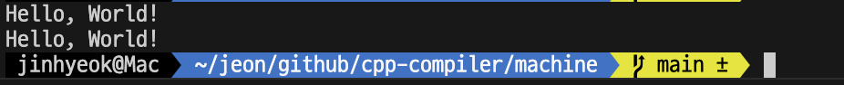
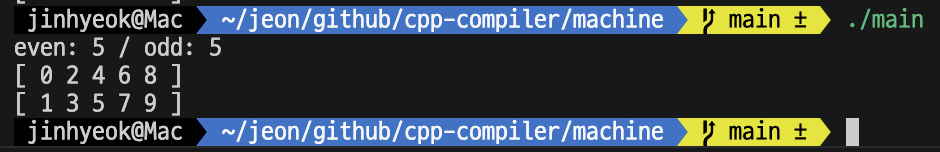

# 6. 가상머신

유랭 컴파일러는 유랭 가상머신을 대상으로 목적 코드를 생성했으므로 생성한 목적 코드를 실행할 가상머신이 필요하다. 이번 장에서는 유랭의 가상머신을 구현해 목적 코드를 실행해 본다. 

목적 코드를 실행하는 방법은 단순하다. 코드 생성 단계의 결과물은 선형 구조인 코드 리스트이므로 리스트에 담긴 목적 코드를 순차적으로 하나씩 읽고 실행하기를 반복하면 된다.

## 6.1 호출 스택과 스택 프레임

인터프리터에서는 모든 문과 식의 실행이 함수 단위로 이루어졌다. 따라서 무언가를 따로 하지 않아도 함수의 실행은 호출한 순서대로 실행되고, 호출한 순서의 반대로 종료됐다.

함수가 호출되고 종료되는 과정이 마치 자료 구조 중 스택의 동작과 같아 이를 호출 스택이라 한다. 인터프리터는 C++의 호출 스택을 사용해 실행했다. 그런데 코드 생성 단계에서 만든 목적 코드에는 C++의 함수 같은 것은 없으므로 가상 머신은 함수가 호출된 순서대로 실행하고 호출된 순서의 역순으로 종료하도록 호출 스택을 제공해야 한다.

함수는 매개변수와 지역변수를 가진다. 그리고 함수 내에서는 식을 사용할 수 있으므로 식을 계산하기 위한 피연산자 스택이 필요하다. 또한 목적 코드 리스트에서 함수는 명령어들의 묶음이므로 명령어들을 순서대로 실행하기 위한 명령어 포인터가 필요하다.

정리하면 함수를 실행하기 위해서는 변수의 값을 저장할 공간, 식의 피연산자와 결과값을 저장할 공간, 다음에 실행할 명령어의 위치를 가리키는 포인터가 필요하다. 이렇게 함수를 실행하기 위해 필요한 공간을 스택 프레임이라고 한다. 다음은 스택 프레임을 표현한 구조체다.
```cpp
struct StackFrame {
  vector<any> variables;
  vector<any> operandStack;
  size_t instructionPointer = 0;
};
```

호출 스택은 단순히 스택 프레임의 리스트다. 다음과 같다. 호출 스택은 흔히 콜 스택이라고 부른다.
```cpp
static vector<StackFrame> callStack;
```

유랭 가상머신은 명령어 포인터를 스택 프레임, 즉 함수별로 관리한다. 그런데 main() 함수의 스택 프레임을 생성하기 전에는 명령어 포인터를 저장할 공간이 없다. 이를 해결하고자 가상머신은 일종의 스타트 업 함수의 스택 프레임을 생성한다. 코드 리스트의 첫 번째 코드부터 차례대로 실행해야 하므로 명령어 포인터는 0이다.

다음은 아래 코드에 대해 생성된 코드 리스트이다.
```cpp
func main() {
  print(factorial(3));
}

func factorial(var n) {
  if(n < 2) {
    return 1;
  }
  return n * factorial(n - 1);
}
```

```
startup()
- 변수 배열
- 피연산사 스택
- 명령어 포인터: 0
```

주소 0의 코드는 GetGlobal "main" 이고, main() 함수의 주소는 3이다. 피연산자 스택에 3을 넣는다. 그리고 주소 0의 코드를 실행했으므로 명령어 포인터는 1 증가한다.

```
startup()
- 변수 배열
- 피연산자 스택: 3
- 명령어 포인터: 1
```

주소 1의 코드는 Call [0] 이다. main() 함수의 스택 프레임을 생성해 콜 스택에 넣는다. 이때 main() 함수의 명령어 포인터 초기값은 startup() 함수의 피연산자 스택에서 가져온다.

```
startup()
- 변수 배열
- 피연산자 스택
- 명령어 포인터: 1
main()
- 변수 배열
- 피연산자 스택
- 명령어 포인터: 3
```

main() 함수의 목적 코드를 실행하다가 주소 5의 코드 GetGlobal "factorial"을 실행한 상태를 보자.

```
startup()
- 변수 배열
- 피연산자 스택
- 명령어 포인터: 1
main()
- 변수 배열
- 피연산자 스택: 3, 9
- 명령어 포인터: 5
```

주소 6의 코드는 Call [1] 이다. factorial() 함수의 스택 프레임을 생성해 콜 스택에 넣는다. 이때 main() 함수의 피연산자 스택에 있던 factorial() 함수의 주소 9는 factorial() 함수의 명령어 포인터 값이 된다.

```
startup()
- 변수 배열
- 피연산자 스택
- 명령어 포인터: 1
main()
- 변수 배열
- 피연산자 스택:
- 명령어 포인터: 6
factorial(3)
- 변수 배열: 3
- 피연산자 스택
- 명령어 포인터: 9
```

factorial() 함수의 목적 코드를 실행하다가 주소 21의 코드 GetGlobal "factorial"을 실행한 상태를 보자.

```
startup()
- 변수 배열
- 피연산자 스택
- 명령어 포인터: 1
main()
- 변수 배열
- 피연산자 스택:
- 명령어 포인터: 6
factorial(3)
- 변수 배열: 3
- 피연산자 스택: 3, 2, 9
- 명령어 포인터: 21
```

이 때 factorial() 함수의 피연산자 스택에는 식 n * factorial(n - 1) 의 피연산자 값들이 쌓여있다. 3은 매개변수 n의 값이고, 2는 n - 1 의 결과값이고, 9는 factorial() 함수의 주소다.

주소 22의 코드는 Call[1] 이다. factorial() 함수의 스택 프레임을 생성해 콜 스택에 넣는다. factorial() 함수를 처음 호출했을 때와 마찬가지로 피연산자 스택에 쌓여 있는 값 9는 새로 호출하는 factorial() 함수의 명령어 포인터가 되고, 값 2는 새로 호출하는 factorial() 함수의 매개변수 n의 값이 된다.
```
startup()
- 변수 배열
- 피연산자 스택
- 명령어 포인터: 1
main()
- 변수 배열
- 피연산자 스택: 
- 명령어 포인터: 6
factorial(3)
- 변수 배열: 3
- 피연산자 스택: 3
- 명령어 포인터: 22
factorial(2)
- 변수 배열: 2
- 피연산자 스택
- 명령어 포인터: 9
```

계속해서 목적 코드를 실행하다가 factorial() 함수에서 매개변수 n의 값이 2보다 작을 때 1을 반환하는 시점을 살펴보자. 목적코드 주소 15에 해당한다.
```
startup()
- 변수 배열
- 피연산자 스택
- 명령어 포인터: 1
main()
- 변수 배열
- 피연산자 스택:
- 명령어 포인터: 6
factorial(3)
- 변수 배열: 3
- 피연산자 스택: 3
- 명령어 포인터: 22
factorial(2)
- 변수 배열: 2
- 피연산자 스택: 2
- 명령어 포인터: 22
factorial(1)
- 변수 배열: 1
- 피연산자 스택: 1
- 명령어 포인터: 15
```

주소 15의 Return 코드가 실행되면 factorial(1) 함수의 스택 프레임이 콜 스택에서 제거된다. 이때 피연산자 스택에 쌓여 있는 반환값 1은 factorial(2) 함수의 피연산자 스택에 들어가고, factorial(2) 함수의 명령어 포인터는 1 증가해 23이 된다.
```
startup()
- 변수 배열
- 피연산자 스택
- 명령어 포인터: 1
main()
- 변수 배열
- 피연산자 스택:
- 명령어 포인터: 6
factorial(3)
- 변수 배열: 3
- 피연산자 스택: 3
- 명령어 포인터: 22
factorial(2)
- 변수 배열: 2
- 피연산자 스택: 2, 1
- 명령어 포인터: 23
```

주소 23의 Multiply 코드는 피연산자 스택에서 값 두개를 꺼내 곱한 후 그 결과값을 다시 피연산자 스택에 넣으므로 factorial(2) 함수의 피연산자 스택에는 2와 1의 곱인 2가 남게 된다. 이어서 주소 24의 Return 코드가 실행되면 마찬가지로 factorial(2) 함수의 스택 프레임이 콜 스택에서 제거된다. 또한 이 과정에서 피연산자 스택에 쌓여 있는 2가 factorial(2) 함수의 반환값이 돼 factorial(3) 함수의 피연산자 스택에 들어가고 factorial(3) 함수의 명령어 포인터는 1 증가해 23이 된다.
```
startup()
- 변수 배열
- 피연산자 스택
- 명령어 포인터: 1
main()
- 변수 배열
- 피연산자 스택:
- 명령어 포인터: 6
factorial(3)
- 변수 배열: 3
- 피연산자 스택: 3, 2
- 명령어 포인터: 23
```

factorial(3) 함수는 명령어 23을 실행하며 피연산자 스택에서 두 값을 꺼내 곱한 결과값인 6을 다시 피연산자 스택에 넣는다. 주소 24의 코드를 실행하면 main() 함수의 피연산자 스택에는 6이 들어가고, 명령어 포인터는 1 증가해 7이 된다.
```
startup()
- 변수 배열
- 피연산자 스택
- 명령어 포인터: 1
main()
- 변수 배열
- 피연산자 스택: 6
- 명령어 포인터: 7
```

주소 7의 Print [1] 코드는 피연산자 스택에서 값 하나를 꺼내 콘솔에 출력하므로, 콘솔에 숫자 6이 출력되며 피연산자 스택은 비게 된다. 이어서 주소 8의 Return 코드가 실행되면 main() 함수의 스택 프레임이 콜 스택에서 제거되고 startup() 함수의 명령어 포인터가 2가 된다.
```
startup()
- 변수 배열
- 피연산자 스택
- 명령어 포인터: 2
```

주소 2의 코드는 Exit 이므로 가상머신은 startup() 함수의 스택 프레임을 콜 스택에서 제거한 후 프로그램의 실행을 종료한다.

## 6.2 코드 실행기

가상머신, 코드 실행기는 목적 코드 리스트를 순회하며 실행하는 프로그램을 뜻하므로 코드 리스트와 함수 테이블, 전역변수 셋을 입력받는다. 코드를 실행하는 execute() 함수를 Main.h 에 선언하자.
```cpp
auto execute(tuple<vector<Code>, map<string, size_t>, set<string>>&) -> void;
```

main() 함수에서는 코드 리스트와 함수 테이블, 전역변수 셋을 인자로 넘겨 execute() 함수를 호출한다.
```cpp
vector<Token> tokenList = scan(sourceCode);
Program* syntaxTree = parse(tokenList);
tuple<vector<Code>, map<string, size_t>, set<string>> objectCode = generate(syntaxTree);
execute(objectCode);
```

## 6.2.1 실행과 종료

execute() 함수에서는 코드 리스트의 첫 번째 코드부터 실행하고자 startup() 함수의 스택 프레임을 생성해 콜 스택에 넣는다. 새로 생성된 스택 프레임의 명령어 포인터는 0이다.
```cpp
auto execute(tuple<vector<Code>, map<string, size_t>, set<string>>&) -> void {
  callStack.emplace_back();
}
```

가상머신은 세 가지 동작을 반복한다. 첫 번째는 현재 실행중인 함수의 스택 프레임의 명령어 포인터로 실행할 코드를 가져온다. 두 번째는 코드의 명령어에 따라 분기해 적절한 동작을 수행한다. 세 번째는 명령어 포인터를 1 증가시킨다. 이 세 가지 동작을 반복하도록 무한 루프를 기본으로 한다.
```cpp
vector<Code> codeList = get<0>(objectCode);
map<string, size_t> functionTable = get<1>(objectCode);
for(const string& name: get<2>(objectCode)) {
  global[name] = any();
}
while(true) {

}
```

루프 안에서는 첫 번째 동작인 실행할 코드를 가져온다. 이때 명령어 포인터는 콜 스택의 최상단에 있는 스택 프레임의 명령어 포인터이다. 실행할 코드를 가져온 후에는 두 번째 동작인 코드의 명령에 따라 분기해 적절한 동작을 수행한다.
```cpp
Code code = codeList[callStack.back().instructionPointer];
switch (code.instruction) {
  case Instruction::Exit: {
    callStack.pop_back();
    return;
  }
}
```

명령어에 따라 적절한 동작을 수행한 후에는 세 번째 동작인 명령어 포인터를 1 증가시킨다. 이때 이 명령어 포인터는 콜 스택의 최상단에 있는 스택 프레임의 명령어 포인터다.
```cpp
callStack.back().instructionPointer += 1;
```

switch문에 Exit 명령을 추가했던 것과 같이 앞으로 할 일은 명령어별로 case문을 추가해 적절한 동작을 수행하도록 하는 것이다. 우선 "Hello, World!" 문자열을 출력하는 프로그램이 동작하도록 구현하자.

## 6.2.2 함수의 주소

먼저 case문을 추가해 GetGlobal "main" 코드가 실행되도록 구현한다.
```cpp
case Instruction::GetGlobal: {
  break;
}
```

GetGlobal 명령의 인자는 함수명이므로 코드의 인자를 문자열로 변환한다. 이후 함수명으로 함수 테이블을 검색해 함수 주소를 피연산자 스택에 넣는다. 등록된 함수 또는 전역변수가 없다면 에러를 출력하고 종료한다.
```cpp
case Instruction::GetGlobal: {
  string name = toString(code.operand);
  if (functionTable.count(name)) {
    pushOperand(functionTable[name]);
  }
  else if (builtinFunctionTable.count(name)) {
    pushOperand(name);
  }
  else if (global.count(name)) {
    pushOperand(global[name]);
  }
  else {
    cout << name << " doesn't exist." << endl;
    exit(1);
  }
  break;
}
```

## 6.2.3 함수 호출

Call 코드가 실행되도록 구현한다. 호출할 함수의 주소는 피연산자 스택에 있으므로 피연산자 스택에서 값을 하나 꺼내온다. 이후 피연산자 스택에서 꺼내온 값이 주소라면 스택 프레임을 생성하고 생성한 스택 프레임의 명령어 포인터를 호출할 함수의 주소로 설정한다.
```cpp
any operand = popOperand();
if (isSize(operand)) {
  StackFrame stackFrame;
  stackFrame.instructionPointer = toSize(operand);
}
```

Call 명령의 인자는 현재 스택 프레임의 피연산자 스택에 쌓여 있는 함수 호출 인자의 개수다. 인자의 값만큼 현재 스택 프레임의 피연산자 스택에서 값을 꺼내 새로 생성한 스택 프레임의 변수 배열에 추가한다. 함수 호출 인자를 매개변수로 만드는 과정이다. 이후 초기화된 스택 프레임을 콜 스택에 넣고 명령어 포인터가 증가되지 않도록 continue문으로 Call 명령의 실행을 끝낸다.
```cpp
for (size_t i = 0; i < toSize(code.operand); ++i) {
  stackFrame.variables.push_back(popOperand());
}
callStack.push_back(stackFrame);
continue;
```

## 6.2.4 메모리 할당

Alloca 명령은 지역변수들의 값을 저장할 공간을 확보한다. 지역변수들의 값은 스택 프레임의 변수 배열에 저장되므로 변수 배열의 크기를 늘리면 된다.
```cpp
size_t localSize = toSize(code.operand);
callStack.back().variables.resize(localSize);
break;
```

## 6.2.5 문자열 리터럴

PushString 명령은 문자열을 인자로 가진다. 단순히 피연산자 스택에 명령의 인자값을 넣으면 구현이 끝난다.
```cpp
cas Instruction::PushString: {
  pushOperand(code.operand);
  break;
}
```

## 6.2.6 콘솔 출력

Print 명령은 콘솔에 출력할 값의 개수를 인자로 가진다. 인자의 크기만큼 피연산자 스택에서 값을 꺼내 콘솔에 출력한다.
```cpp
for (size_t i = 0; i < toSize(code.operand); ++i) {
  any value = popOperand();
  cout << value;
}
break;
```

## 6.2.7 return 문

return 명령은 함수의 값을 반환하고 함수를 종료한다. 함수의 반환값으로 현재 스택 프레임의 피연산자 스택에 있는 값을 꺼내 임시로 보관한다. 피연산자 스택에 남아 있는 값이 없다면 널을 기본값으로 한다.

이후 현재 스택 프레임을 콜 스택에서 제거해 함수를 종료한다. 이제 현재 스택 프레임은 종료된 함수를 호출했던 함수의 스택 프레임이 된다. 이후 임시로 보관했던 반환값을 현재 스택 프레임의 피연산자 스택에 넣는다.
```cpp
any result = nullptr;
if (!callStack.back().operandStack.empty()) {
  result = callStack.back().operandStack.back();
}
callStack.pop_back();
callStack.back().operandStack.push_back(result);
break;
```

return문이 종료되면, 현재 스택프레임은 종료된 함수를 호출했던 함수의 스택 프레임이 되는데, 이 상태에서 ++callStack.back().instructionPointer; 코드가 실행되므로, Call 명령어 다음 명령어를 실행하게 된다.

다음은 함수 호출 및 print, return 테스트이다.
```cpp
func main() {
  hello();
  hello();
}

func hello() {
  printLine("Hello, World!");
}
```


## 6.2.8 덧셈 연산

Add 명령은 두 개의 피연산자를 가지는 덧셈 명령이다. 먼저 피연산자 스택에서 오른쪽 피연산자와 왼쪽 피연산자를 차례로 꺼낸다. 코드를 생성할 때 왼쪽 식 노드를 먼저 순회한 후 오른쪽 식 노드를 순해했다는 것과 스택을 사용해 계산하고 있다는 것을 상기하자.
```cpp
case Instruction::Add: {
  any rValue = popOperand();
  any lValue = popOperand();
}
```

연산에 필요한 피연산자를 꺼내온 후에는 두 피연산자의 데이터 타입에 따라 연산을 하고 결과값을 다시 피연산자 스택에 넣는다.
```cpp
if (isNumber(lValue) && isNumber(rValue)) {
  pushOperand(toNumber(lValue) + toNumber(rValue));
}
else if (isString(lValue) && isString(rValue)) {
  pushOperand(toString(lValue) + toString(rValue));
}
else {
  cout << lValue << " + " << rValue << " is wrong." << endl;
  exit(1);
}
```

## 6.2.9 논리 or 연산

LogicalOr 명령은 왼쪽 식의 값이 참인지 거짓인지에 따라 동작이 달라진다. 피연산자 스택에서 꺼낸 왼쪽 식의 결과가 거짓이라면, 오른쪽 식의 결과가 or 연산의 결과이므로 아무것도 하지 않는다.

왼쪽 식의 결과가 참이라면 이 값이 or 연산의 결과이므로 피연산자 스택에서 꺼냈던 값을 그대로 다시 넣는다. 그리고 오른쪽 식의 코드를 실행하지 않도록 명령어 포인터를 LogicalOr 명령의 인자의 주소로 설정하고, continue문을 사용한다. 만약 break 문을 사용했다면 while문의 끝에서 명령어 포인터가 1 증가하게 된다.
```cpp
case Instruction::LogicalOr: {
  any value = popOperand();
  if (isTrue(value)) {
    pushOperand(value);
    callStack.back().instructionPointer = toSize(code.operand);
    continue;
  }
  break;
}
```

논리 and 연산도 비슷하게 구현 가능하다.

## 6.2.10 변수 참조

GetLocal 명령은 지역변수의 값을 참조한다. 참조할 지역변수의 오프셋을 인자로 가지므로 현재 스택 프레임의 변수 배열에서 오프셋 위치에 저장돼 있는 값을 피연산자 스택에 넣는다.
```cpp
case Instruction::GetLocal: {
  size_t index = toSize(code.operand);
  pushOperand(callStack.back().variables[index]);
  break;
}
```

SetLocal 명령은 지역변수의 값을 변경한다. 마찬가지로 오프셋을 인자로 가지므로 현재 스택 프레임의 변수 배열의 오프셋 위치에 값을 대입한다.
```cpp
case Instruction::SetLocal: {
  size_t index = toSize(code.operand);
  callStack.back().variables[index] = peekOperand();
  break;
}
```

대입 연산은 연산의 결과를 피연산자 스택에 남겨야 하므로 popOperand()가 아닌 peekOperand() 함수를 사용한다. peekOperand() 보조함수는 스택에서 값을 제거하지 않는다.
```cpp
static auto peekOperand() -> any {
  return callStack.back().operandStack.back();
}
```

GetGlobal 명령은 전역변수를 참조하는 명령어인데, 이름을 인자로 가진다. 따라서 map<string, any> global에 해당 이름으로 등록된 전역변수가 있다면 값을 피연산자 스택에 넣는다.
```cpp
else if (global.count(name)) {
  pushOperand(global[name]);
}
```

SetGlobal 명령은 전역변수의 값을 변경한다. 명령의 인자인 전역변수 이름과 피연산자 스택에서 꺼낸 값을 global 전역변수에 키와 값으로 등록한다. 

> 책과 다르게 전역변수의 선언이 가능하도록 바꾸었으므로 해당 이름의 전역변수가 존재하는지 먼저 확인한다.
```cpp
case Instruction::SetGlobal: {
  string name = toString(code.operand);
  if (global.count(name) == 0) {
    cout << name << " doesn't exist." << endl;
    exit(1);
  }
  global[name] = peekOperand();
  break;
}
```

## 6.2.11 for문과 if문

코드를 생성하면서 for문과 if문 노드에서는 두 가지 종류의 점프 명령을 생성했다. 하나는 조건 없는 점프를 하는 Jump 명령이고 다른 하나는 조건식의 결과에 따라 점프를 하는 ConditionJump 명령이다. 두 명령 모두 점프할 주소를 인자로 가진다.

Jump 명령의 구현은 간단하게 현재 스택 프레임의 명령어 포인터를 인자의 주소로 변경한다. break문이 아닌 continue문을 사용한다.
```cpp
case Instruction::Jump: {
  callStack.back().instructionPointer = toSize(code.operand);
  continue;
}
```

ConditionJump 명령은 조건식의 결과에 따라 점프를 하므로 우선 피연산자 스택에서 조건식의 결과값을 꺼내온다. 조건식의 결과값이 참이라면 점프를 하지 않고, 참이 아니라면 스택 프레임의 명령어 포인터를 인자의 주소로 변경하고 continue문을 적는다.
```cpp
case Instruction::ConditionJump: {
  any condition = popOperand();
  if (isTrue(condition)) {
    break;
  }
  callStack.back().instructionPointer = toSize(code.operand);
  continue;
}
```

## 6.2.12 내장함수

> 책에서는 아래와 같이 GetGlobal 명령의 인자가 내장함수의 이름이면 내장함수 자체를 스택에 푸쉬한다. 나는 이렇게 하지 않고 내장 함수의 이름을 스택에 푸쉬하고, Call 함수 내에서 내장함수를 찾아 호출하는 방식으로 구현하겠다.

```cpp
else if (builtinFunctionTable.count(name))
  pushOperand(builtinFunctionTable[name]);

-> 

else if (builtinFunctionTable.count(name)) {
  pushOperand(name);
}

if (isBuiltinFunction(operand)) {
  vector<any> arguments;
  for (auto i = 0; i < toSize(code.operand); ++i)
    arguments.push_back(popOperand());
  pushOperand(toBuiltinFunction(operand)(arguments));
  break;
}

-> 

else if (isString(operand) && builtinFunctionTable.count(toString(operand))) {
  vector<any> arguments;
  for (size_t i = 0; i < toSize(code.operand); ++i) {
    arguments.push_back(popOperand());
  }
  pushOperand(builtinFunctionTable[toString(operand)](arguments));
  break;
}
```

## 6.2.13 배열 리터럴

PushArray 명령은 배열을 생성해 피연산자 스택에 넣는 명령이다. 우선 피연산자 스택에 넣을 배열을 생성한다. PushArray 명령의 인자는 원소의 개수이므로 피연산자 스택에서 원소의 개수만큼 꺼내 생성해둔 배열에 추가한다.
```cpp
case Instruction::PushArray: {
  Array* result = new Array();
  size_t size = toSize(code.operand);
  for (size_t i = 0; i < size; ++i) {
    result->values.push_back(popOperand());
  }
  pushOperand(result);
  break;
}
```

## 6.2.14 원소값 참조

GetElement 명령은 배열이나 맵의 원소값을 참조한다. 우선 피연산자 스택에서 인덱스 식과 피연산자 식의 값을 차례로 꺼내온다. GetElement 노드에서 코드를 생성할 때 피연산자 식을 먼저 순회했음을 주의한다.
```cpp
case Instruction::GetElement: {
  any index = popOperand();
  any object = popOperand();
  if (isArray(object) && isNumber(index)) {
    pushOperand(getValueOfArray(object, index));
  }
  else if (isMap(object) && isString(index)) {
    pushOperand(getValueOfMap(object, index));
  }
  else {
    cout << "Reference error." << endl;
    exit(1);
  }
  break;
}
```

## 6.2.15 원소값 변경

SetElement 명령은 배열이나 맵의 원소값을 변경한다. GetElement 명령과 마찬가지로 피연산자 스택에서 인덱스 식과 피연산자 식의 값을 차례로 꺼내온다. 이후 피연산자 스택에 있는 값으로 배열 또는 맵의 원소값을 변경한다.
```cpp
case Instruction::SetElement: {
  any index = popOperand();
  any object = popOperand();
  if (isArray(object) && isNumber(index)) {
    pushOperand(setValueOfArray(object, index, peekOperand()));
  }
  else if (isMap(object) && isString(index)) {
    pushOperand(setValueOfMap(object, index, peekOperand()));
  }
  else {
    cout << "Reference error." << endl;
    exit(1);
  }
  break;
}
```

## 6.2.16 가비지 컬렉터

앞선 PushArray 명령의 구현과 같이 유랭 가상머신은 배열과 맵을 힙에 생성하므로 동적 메모리를 관리할 필요가 있다. 알려진 메모리 관리 기법들 중 구현이 간단한 **mark-sweep**를 사용해보자.

mark는 표시를, sweep는 해제를 뜻한다. 따라서 마크 스윕은 할당한 메모리에 참조 여부를 표시하고 표시가 돼 있지 않은 메모리를 해제하는 방식이다.

참조 여부를 멤버로 갖는 구조체를 정의하자. isMarked 멤버변수가 true면 참조되고 있는 객체다.
```cpp
Struct Object {
  bool isMarked = false;
  virtual ~Object() = default;
};
```

실제로 관리하려는 메모리는 배열과 맵이므로 Array 구조체와 Map 구조체가 Object 구조체를 상속하도록 한다.
```cpp
struct Array: Object {
  vector<any> values;
};
```

다음은 객체에 참조 표시를 하는 함수이다. 매개변수로 받은 값이 배열이나 맵이면 isMarked 멤버변수의 값을 true로 바꿔 참조되고 있음을 표시한다.

배열은 배열이나 맵을, 맵은 맵이나 배열을 원소로 가질 수 있으므로 원소마다 markObject() 함수를 다시 호출해 재귀적으로 표시한다.
```cpp
if (isArray(value)) {
  if (toArray(value)->isMarked) return;
  toArray(value)->isMarked = true;
  for (any& value : toArray(value)->values) {
    markObject(value);
  }
}
else if (isMap(value)) {
  if (toMap(value)->isMarked) return;
  for (auto& [key, value] : toMap(value)->values) {
    markObject(value);
  }
}
```

참조의 시작접은 변수다. 어떤 변수에 담긴 값이 배열이나 맵이라면 그 객체는 참조되고 있다고 볼 수 있다. 변수들을 순회하는 함수를 정의하자.

배열이나 맵이 생성되는 시점이나 함수의 반환값으로 사용되고 있는 시점에서는 식에서 피연산자로서만 참조되고 있는 경우도 있으므로 스택 프레임의 피연산자 스택도 순회한다.

마찬가지로 전역 변수가 참조하고 있는 배열과 맵도 참조 표시가 되도록 한다.
```cpp
static auto collectGarbage() -> void {
  for (auto& stackFrame : callStack) {
    for (auto& value : stackFrame.variables) {
      markObject(value);
    }
    for (auto& value : stackFrame.operandStack) {
      markObject(value);
    }
  }
  for (auto& [key, value] : global) {
    markObject(value);
  }
  sweepObject();
}
```

마크 스윕에서 마크를 했으니 이제 스윕을 할 차례다. 할당한 메모리를 해제하기 위해서는 접근이 가능해야 하므로 참조 가능 여부와 관계없이 할당한 모든 맵과 배열을 담는 리스트를 선언한다.
```cpp
static list<Object*> objects;
```

배열을 생성하는 pushArray 명령과 맵을 생성하는 PushMap 명령의 구현에서 생성한 배열과 맵을 objects 리스트에 담는다.
```cpp
pushOperand(result);
objects.push_back(result);
break;
```

스윕은 단순히 objects 리스트를 순회하면서 참조 표시가 된 객체는 다음번의 마크 단계를 위해 표시를 제거하고, 표시가 돼 있지 않은 객체는 메모리를 해제한 후 objects 리스트에서 제거한다.
```cpp
static auto sweepObject() -> void {
  objects.remove_if([](Object* object) {
    if (object->isMarked) {
      object->isMarked = false;
      return false;
    }
    delete object;
    return true;
  });
}
```

스윕은 마크의 다음 단계이므로 collectGarbage() 함수에서 일련의 마크 과정이 끝난 후 실행하면 된다. 이로써 마크 스윕의 구현이 끝났다.

이제 남은 것은 언제, 그래고 얼마나 자주 collectGarbage() 함수를 호출해 마크 스윕을 실행할지를 결정하는 것이다. 마크 스윕을 실행하는 중에는 코드의 실행이 중단되므로 호출 주기가 짧을수록 메모리는 덜 사용하겠지만 프로그램의 실행은 더 자주 중단된다.

반대로 호출 주기가 길수록 프로그램의 실행은 덜 중단되겠지만 메모리는 더 많이 사용한다. 또한 마크 스윕을 한 번 실행하는 데 드는 비용은 그 순강 생ㅅ어돼 있는 객체의 개수에 비례해 증가하므로 단순히 더 자주 호출한다고 프로그램의 실행 시간이 더 많이 늘어나고, 덜 자주 호출한다고 더 적게 늘어난다고 단정할 수 없다.

여기서는 단순하게 Return 명령을 실행하는 case문의 끝 부분에 collectGarbage() 함수를 호출한다.

다음은 테스트이다.
```cpp
var evenList = [];
var oddList = [];
var even = 0;
var odd = 0;

func main() {
  for(var i = 0; i < 10; ++i) {
    if(i % 2 == 0) {
      ++even;
      push(evenList, i);
    }
    else {
      ++odd;
      push(oddList, i);
    }
  }
  printLine("even: ", even, " / odd: ", odd);
  printLine(evenList);
  printLine(oddList);
}
```

